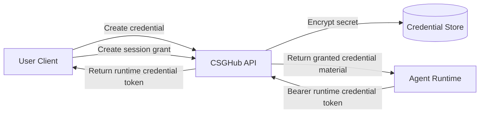
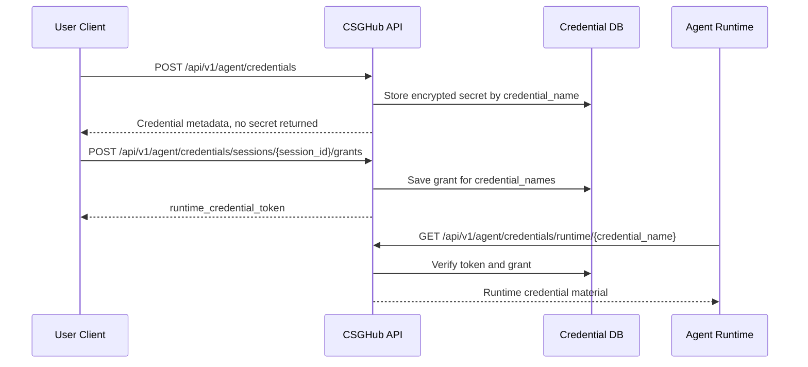
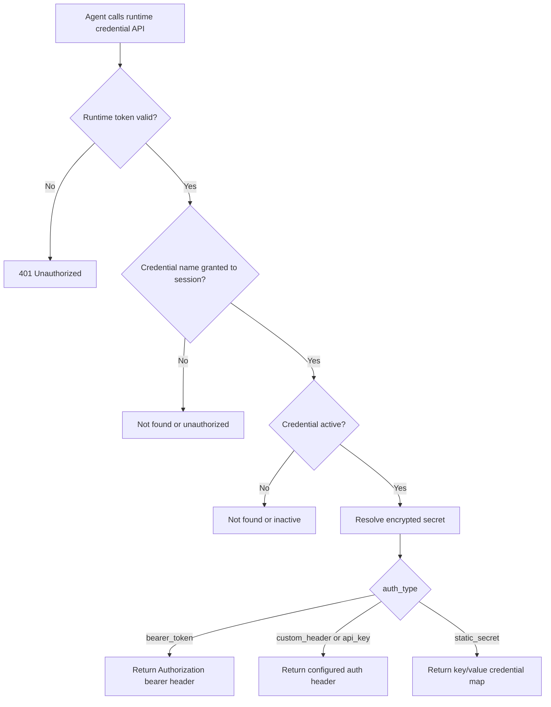

# Agent Credential User Guide

## What It Does

Agent credentials let a user save private secret material once, then grant a running agent session short-lived access to selected credentials.

The normal user token is used to manage credentials and create grants. The agent runtime uses a separate runtime credential token to fetch only the credentials that were granted for its session.



## Key Concepts

Credential

A credential is a named secret owned by one user. Clients use `credential_name` as the stable identifier, not the numeric database ID.

Examples:

```text
gitlab-devops
internal-api
aliyun-oss
```

Provider

Supported providers:

| Provider | Use Case |
| --- | --- |
| `gitlab` | First-class GitLab credential. UI should auto-fill `credential_name` as `gitlab`. |
| `generic` | Custom service credential for bearer tokens, API keys, custom headers, or static key/value secrets. |

Supported auth types:

| Auth Type | Use Case | Runtime Shape |
| --- | --- | --- |
| `bearer_token` | GitLab token, external API bearer token | `Authorization: Bearer <secret>` |
| `custom_header` | API that requires a named header | `<header_name>: <secret>` |
| `api_key` | API key header, defaults to `X-API-Key` | `<header_name>: <secret>` |
| `static_secret` | Multi-field credentials, such as Aliyun OSS | `credential` key/value map |

Provider definitions can be fetched by UI clients:

```http
GET /api/v1/agent/credentials/providers
Authorization: Bearer <user_auth_token>
```

GitLab currently supports only `bearer_token`. Generic supports `bearer_token`, `custom_header`, `api_key`, and `static_secret`.

Secret Backend

Users do not choose the backend in API requests. Operators choose one backend for the service:

```text
OPENCSG_CREDENTIAL_SECRET_BACKEND=postgres_encrypted
```

Supported values are `postgres_encrypted` and `hashicorp_vault_kv2`. For Vault KV v2, configure `OPENCSG_CREDENTIAL_VAULT_ADDRESS`, `OPENCSG_CREDENTIAL_VAULT_TOKEN`, `OPENCSG_CREDENTIAL_VAULT_NAMESPACE`, `OPENCSG_CREDENTIAL_VAULT_KV_DEFAULT_MOUNT`, and `OPENCSG_CREDENTIAL_VAULT_TIMEOUT_SECONDS`.

Session Grant

A session grant says: this agent session can use these credential names until the grant expires.

Runtime Credential Token

The runtime credential token is returned when creating a session grant. The agent runtime uses it as:

```http
Authorization: Bearer <runtime_credential_token>
```

It is not the user's login token and should only be used for runtime credential fetch/revoke calls.

## End-To-End Flow



## Step 1: Create A Credential

Management APIs require the user's normal auth token:

```http
Authorization: Bearer <user_auth_token>
```

### GitLab Token

GitLab is saved as a first-class `gitlab` provider credential. The UI should auto-fill `credential_name` as `gitlab`.

```http
POST /api/v1/agent/credentials
Authorization: Bearer <user_auth_token>
Content-Type: application/json
```

```json
{
  "credential_name": "gitlab",
  "provider": "gitlab",
  "auth_type": "bearer_token",
  "description": "GitLab token for repository access",
  "credential": {
    "token": "replace_with_gitlab_token"
  },
  "metadata": {
    "base_url": "https://git-devops.opencsg.com/"
  }
}
```

Create response returns metadata only:

```json
{
  "msg": "OK",
  "data": {
    "id": 1,
    "credential_name": "gitlab",
    "provider": "gitlab",
    "auth_type": "bearer_token",
    "description": "GitLab token for repository access",
    "secret_backend": "postgres_encrypted",
    "metadata": {
      "base_url": "https://git-devops.opencsg.com/"
    },
    "status": "active"
  }
}
```

### Custom Header Credential

Use this when a service expects a specific header.

```json
{
  "credential_name": "internal-api",
  "provider": "generic",
  "auth_type": "custom_header",
  "description": "Internal API key",
  "credential": {
    "value": "replace_with_api_key"
  },
  "metadata": {
    "base_url": "https://internal.example.com",
    "header_name": "X-API-Key"
  }
}
```

### Aliyun OSS Credential

Aliyun OSS uses multiple fields, so use `static_secret`.

```json
{
  "credential_name": "aliyun-oss",
  "provider": "generic",
  "auth_type": "static_secret",
  "description": "Aliyun OSS access key",
  "credential": {
    "access_key_id": "replace_with_access_key_id",
    "access_key_secret": "replace_with_access_key_secret"
  },
  "metadata": {
    "base_url": "https://oss-cn-hangzhou.aliyuncs.com"
  }
}
```

## Step 2: Grant Credential Access To An Agent Session

```http
POST /api/v1/agent/credentials/sessions/session-credential-demo-001/grants
Authorization: Bearer <user_auth_token>
Content-Type: application/json
```

```json
{
  "agent_id": "email-agent",
  "task_id": "task-credential-demo-001",
  "credential_names": ["gitlab"],
  "duration_secs": 900
}
```

Save the returned runtime credential token:

```json
{
  "msg": "OK",
  "data": {
    "runtime_credential_token": "eyJhbGciOiJIUzI1NiIs...",
    "token_type": "Bearer",
    "expires_at": "2026-04-16T08:15:00Z"
  }
}
```

## Step 3: Agent Fetches Runtime Credential Material

The agent runtime uses the runtime credential token, not the user's token.

```http
GET /api/v1/agent/credentials/runtime/gitlab
Authorization: Bearer <runtime_credential_token>
```

Bearer-token runtime response:

```json
{
  "msg": "OK",
  "data": {
    "credential_name": "gitlab",
    "provider": "gitlab",
    "auth_type": "bearer_token",
    "credential": {
      "Authorization": "Bearer glpat_xxx"
    },
    "metadata": {
      "base_url": "https://git-devops.opencsg.com/"
    },
    "expires_at": "2026-04-16T08:15:00Z"
  }
}
```

Static-secret runtime response:

```json
{
  "msg": "OK",
  "data": {
    "credential_name": "aliyun-oss",
    "provider": "generic",
    "auth_type": "static_secret",
    "credential": {
      "access_key_id": "LTAI_xxx",
      "access_key_secret": "secret_xxx"
    },
    "metadata": {
      "base_url": "https://oss-cn-hangzhou.aliyuncs.com"
    },
    "expires_at": "2026-04-16T08:15:00Z"
  }
}
```

## Runtime Decision Flow



## Credential Name Rules

`credential_name` must:

- start with a lowercase letter
- contain only lowercase letters, numbers, `_`, or `-`
- be 3 to 63 characters long
- be unique for the current user

Pattern:

```text
^[a-z][a-z0-9_-]{2,62}$
```

Reserved names:

```text
credentials
sessions
```

## Common Operations

List credentials:

```http
GET /api/v1/agent/credentials?per=10&page=1
Authorization: Bearer <user_auth_token>
```

Get credential metadata:

```http
GET /api/v1/agent/credentials/gitlab
Authorization: Bearer <user_auth_token>
```

Update credential description or metadata:

```http
PATCH /api/v1/agent/credentials/gitlab
Authorization: Bearer <user_auth_token>
Content-Type: application/json
```

```json
{
  "description": "Updated GitLab token for repository access",
  "metadata": {
    "base_url": "https://git-devops.opencsg.com/"
  }
}
```

`metadata` is merged. Set a metadata key to `null` to delete it. Provider, auth type, credential name, and secret material are not updated by this API.

Rotate a single-secret credential:

```http
POST /api/v1/agent/credentials/gitlab/rotate
Authorization: Bearer <user_auth_token>
Content-Type: application/json
```

```json
{
  "credential": {
    "token": "replace_with_new_secret"
  }
}
```

Revoke a credential:

```http
POST /api/v1/agent/credentials/gitlab/revoke
Authorization: Bearer <user_auth_token>
```

Delete a credential:

```http
DELETE /api/v1/agent/credentials/gitlab
Authorization: Bearer <user_auth_token>
```

Revoke all unexpired grants for a runtime session:

```http
POST /api/v1/agent/credentials/runtime/session/revoke
Authorization: Bearer <runtime_credential_token>
```

## Practical Notes

- Create/list/get credential APIs never return secret material.
- Runtime credential APIs can return secret material and must only be called by trusted runtime code.
- Use `credential` directly. For HTTP credentials, each key/value pair is a request header.
- For static credentials, each key/value pair is provider-specific secret material.
- Keep `duration_secs` short. The default is `900` seconds, and the server-side maximum defaults to `3600` seconds. Operators can configure it with `OPENCSG_CREDENTIAL_RUNTIME_SESSION_MAX_DURATION_SECONDS`.
- `credential_name` is the client-facing handle. Clients should not depend on numeric credential IDs.
