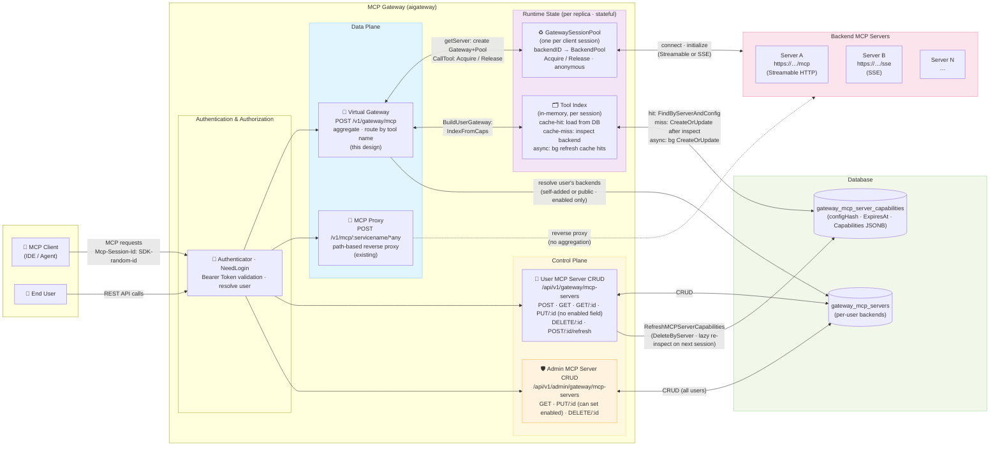
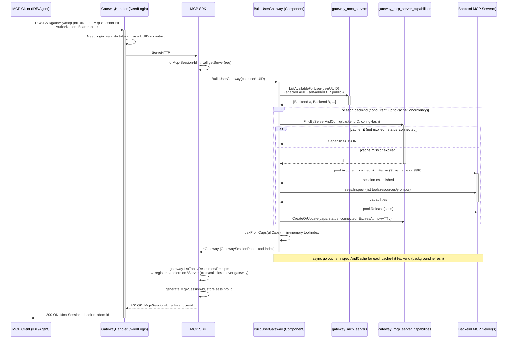
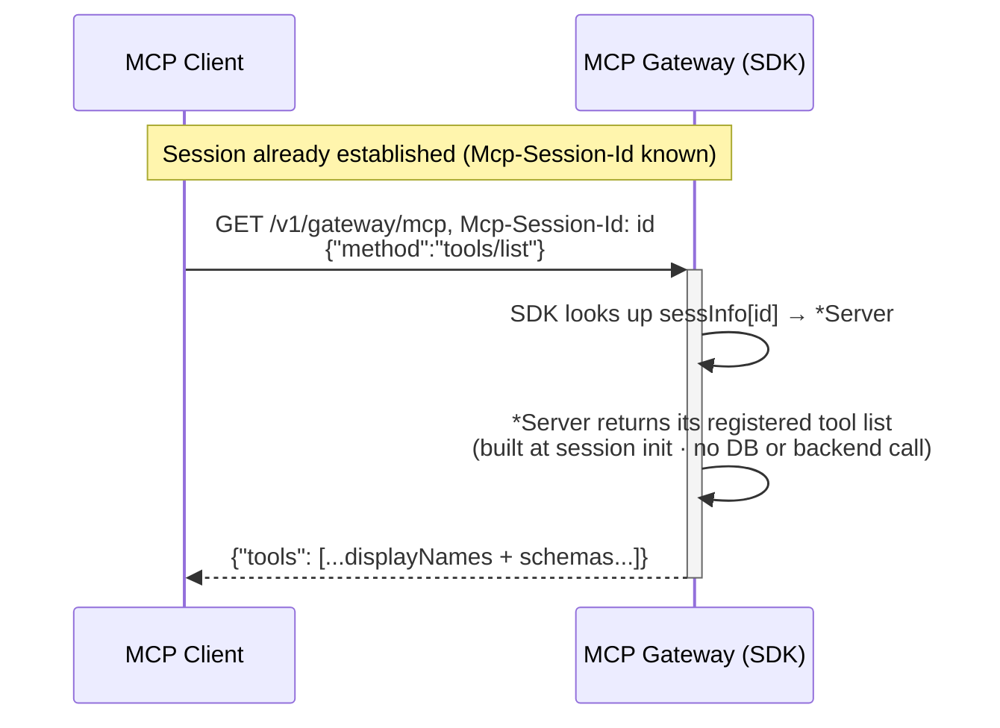
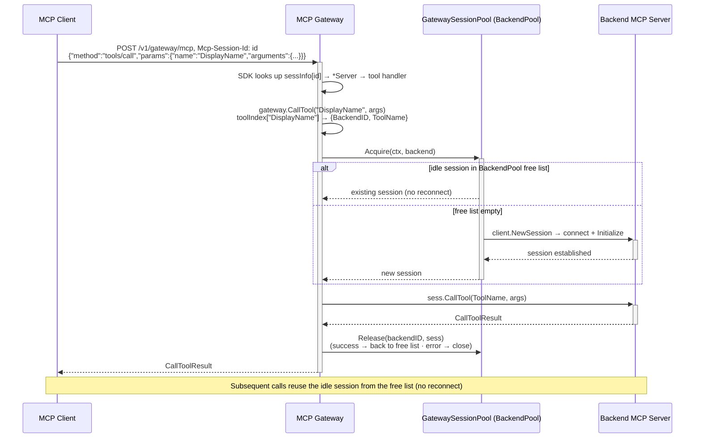
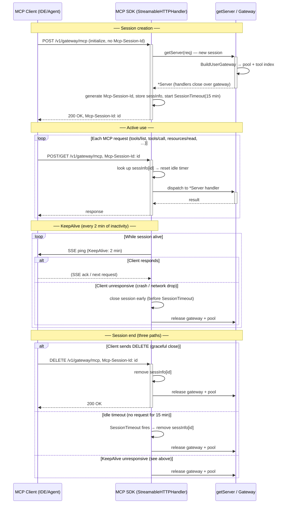

# MCP Gateway

draft design for aggregating multiple MCP servers behind one endpoint (single Go process, Streamable HTTP).

Patterns referenced: [Microsoft MCP Gateway](https://github.com/microsoft/mcp-gateway), [Lasso MCP Gateway](https://github.com/lasso-security/mcp-gateway), [Higress MCP Gateway](https://higress.io/en/docs/ai/mcp-server/), [Envoy MCP Gateway](https://aigateway.envoyproxy.io/docs/0.5/capabilities/mcp/).

---

## Design

### Architecture



- **Single process:** gateway runs in-process under aigateway. Sessions are stateful and pinned to the replica that created them; sticky routing is required for multi-replica deployments.
- **Data plane — Virtual Gateway:** `ANY /v1/gateway/mcp` (Streamable HTTP, SDK-managed `Mcp-Session-Id`). On the first request the SDK calls `getServer`, which runs `BuildUserGateway` to create one `Gateway` + one `GatewaySessionPool` for that client session. Subsequent requests on the same session ID are handled by the same in-process gateway and pool.
- **Data plane — MCP Proxy:** `POST /v1/mcp/:servicename/*any` (existing path-based reverse proxy). The client selects the backend by `servicename`; the handler forwards the request via `builder/proxy.ReverseProxy` with no aggregation. Both endpoints coexist.
- **Client auth:** the client must send the user's token (`Authorization: Bearer <token>`) on every request. The `NeedLogin` middleware validates it and resolves the user, which is used for backend scoping, authorization, and audit.
- **Backends:** external MCP servers (Streamable HTTP or SSE) stored in `gateway_mcp_servers`. **Per-user access:** `BuildUserGateway` loads only backends that are self-added or public, and enabled — users cannot reach backends they did not add or that are disabled.
- **Tool Index (Runtime):** built in-memory per client session during `BuildUserGateway` via `IndexFromCaps`. Capabilities are read from `gateway_mcp_server_capabilities` on cache hit (non-expired, status=connected); on cache miss the gateway connects to the backend, inspects, and writes to the DB. Cache-hit backends are refreshed asynchronously in the background.
- **Session Pool (Runtime):** one `GatewaySessionPool` per client session, keyed by `backendID → BackendPool`. Uses anonymous `Acquire`/`Release` (no `AcquireByID`, no Session Registry). For cache-miss backends, `inspectAndCache` calls `pool.Acquire` → `Inspect` → `pool.Release`, leaving an idle session in the free list so the first `tools/call` to that backend has no handshake latency. Cache-hit backends do not pre-warm a session; the first `tools/call` creates it.
- **Control Plane — User API** (`/api/v1/gateway/mcp-servers`, NeedLogin): full CRUD on the user's own backends. `PUT /:id` cannot set the `enabled` field. `POST /:id/refresh` calls `RefreshMCPServerCapabilities`, which deletes the capability cache row (`DeleteByServer`); the backend is re-inspected lazily on the next session.
- **Control Plane — Admin API** (`/api/v1/admin/gateway/mcp-servers`, NeedAdmin): list/update/delete across all users. `PUT /:id` can set `enabled`, allowing admins to enable or disable any MCP server.

### Data Plane (MCP Gateway)

#### 1.1.1 Session initialization

On the first request (no `Mcp-Session-Id`) the SDK calls `getServer`, which runs `BuildUserGateway` to load backends, populate the tool index from DB cache or live inspect, and build a `*Server` whose handlers close over the user's `Gateway`.



#### 1.1.2 tools/list (after session established)

Tools are registered on the SDK `*Server` at `getServer` time; `tools/list` is served entirely from the SDK's in-memory registry — no DB or backend call.



#### 1.1.3 tools/call — GatewaySessionPool (Acquire / Release)



#### 1.1.4 Client–Gateway session lifecycle

A gateway session is stateful and lives on one replica. `SessionTimeout` (15 min idle) and `KeepAlive` (2 min ping) are the two timers that drive the session lifecycle. `getServer` is only called once per session — on the `initialize` request.



### Control Plane

The control plane manages the registry of backend MCP servers. It has two sets of endpoints — user-facing CRUD and admin operations — backed by two database tables.

#### Database tables

**`gateway_mcp_servers`** — one row per registered backend

| Column | Type | Notes |
|--------|------|-------|
| `id` | int64 PK | auto-increment |
| `user_uuid` | string NOT NULL | owner of this backend |
| `name` | string NOT NULL UNIQUE | globally unique across all users |
| `description` | string | optional |
| `protocol` | string NOT NULL | `streamable` or `sse` |
| `url` | string NOT NULL | backend endpoint URL |
| `headers` | JSONB | custom request headers forwarded to backend |
| `enabled` | bool NOT NULL (default false for new user-created backends) | gates `ListAvailableForUser`; only admins can set; DB column default is `true` but `CreateMCPServer` always sets `false` |
| `public` | bool NOT NULL (default false) | if true, all users can use this backend |
| `created_at` / `updated_at` | timestamp | managed by `times` embed |

Key constraints:
- `enabled = false` hides the backend from all users including the owner.
- `public = true` makes the backend available to every user via `ListAvailableForUser`.
- New backends created by users start with `enabled = false`; an admin must enable them.
- `name` is unique globally — two users cannot register backends with the same name.

**`gateway_mcp_server_capabilities`** — capability cache for each backend configuration

| Column | Type | Notes |
|--------|------|-------|
| `id` | int64 PK | auto-increment |
| `mcp_server_id` | int64 NOT NULL | FK → `gateway_mcp_servers.id` |
| `mcp_server_name` | string NOT NULL | denormalized name for logging |
| `config_hash` | string NOT NULL | SHA of `url + headers`; cache is per config version |
| `capabilities` | JSONB | tools / resources / prompts from last `Inspect` |
| `status` | string NOT NULL | `connected` or `error` |
| `error` | string | set when status = `error` |
| `refreshed_at` | timestamp NOT NULL | when last inspect ran |
| `expires_at` | timestamp NOT NULL | cache TTL; expired entries trigger re-inspect |
| `created_at` / `updated_at` | timestamp | managed by `times` embed |

Unique index on `(mcp_server_id, config_hash)` — one cache row per backend per config version.

#### User API (`/api/v1/gateway/mcp-servers`, NeedLogin)

| Method | Path | Request | Response | Notes |
|--------|------|---------|----------|-------|
| `POST` | `/api/v1/gateway/mcp-servers` | `CreateGatewayBackendInput` | `GatewayUserBackendResponse` | Creates backend with `enabled=false`; admin must enable |
| `GET` | `/api/v1/gateway/mcp-servers` | query: `page`, `per_page`, `enabled`, `public` | `[]GatewayUserBackendResponse` + total | Lists caller's own backends with optional filters |
| `GET` | `/api/v1/gateway/mcp-servers/:id` | — | `GatewayUserBackendResponse` | Get single backend (must be owned by caller) |
| `PUT` | `/api/v1/gateway/mcp-servers/:id` | `UpdateGatewayBackendInput` | `GatewayUserBackendResponse` | Update name/url/protocol/headers/public; `enabled` field ignored; also invalidates capability cache |
| `DELETE` | `/api/v1/gateway/mcp-servers/:id` | — | `nil` | Delete (must be owned by caller) |
| `POST` | `/api/v1/gateway/mcp-servers/:id/refresh` | — | `nil` | `DeleteByServer` — removes capability cache row; backend re-inspected lazily on next session |

**`CreateGatewayBackendInput`**

| Field | Type | Required | Notes |
|-------|------|----------|-------|
| `name` | string | ✓ | globally unique |
| `description` | string | | |
| `protocol` | string | ✓ | `streamable` or `sse` |
| `url` | string | ✓ | must be a valid URL |
| `headers` | `map[string]any` | | forwarded to backend on every request |
| `public` | bool | | default false |

**`UpdateGatewayBackendInput`** — all fields optional; only provided fields are applied

| Field | Type | Notes |
|-------|------|-------|
| `name` | string | must remain globally unique if changed |
| `description` | string | |
| `protocol` | string | `streamable` or `sse` |
| `url` | string | changing url/headers also invalidates capability cache |
| `headers` | `map[string]any` | |
| `enabled` | `*bool` | user `PUT` ignores this field; admin `PUT` applies it |
| `public` | `*bool` | |

**`GatewayUserBackendResponse`** — returned for all user-facing endpoints

| Field | Type |
|-------|------|
| `id` | int64 |
| `name` | string |
| `description` | string |
| `protocol` | string |
| `url` | string |
| `headers` | `map[string]any` (omitempty) |
| `enabled` | bool |
| `public` | bool |
| `created_at` / `updated_at` | time.Time |

#### Admin API (`/api/v1/admin/gateway/mcp-servers`, NeedAdmin)

| Method | Path | Request | Response | Notes |
|--------|------|---------|----------|-------|
| `GET` | `/api/v1/admin/gateway/mcp-servers` | query: `page`, `per_page`, `enabled`, `public`, `user_uuid` | `[]AdminGatewayMCPServerResponse` + total | List all backends; filter by owner, enabled, or public |
| `PUT` | `/api/v1/admin/gateway/mcp-servers/:id` | `UpdateGatewayBackendInput` | `AdminGatewayMCPServerResponse` | Update any backend regardless of owner; `enabled` field is applied |
| `DELETE` | `/api/v1/admin/gateway/mcp-servers/:id` | — | `nil` | Delete any backend regardless of owner |

**`AdminGatewayMCPServerResponse`** — same as `GatewayUserBackendResponse` plus `user_uuid`

| Additional field | Type | Notes |
|-----------------|------|-------|
| `user_uuid` | string | owner of the backend |


## Plan

### 1. Shared connection pool for public MCP servers

Public MCP servers (`public=true`) are shared by all users with the same URL and headers, so it is wasteful to create a separate `GatewaySessionPool` per client session for them.

**Goal:** maintain one shared `BackendPool` per public backend at the process level, so all sessions reuse the same persistent connections.

**Options:**
- **Lazy load** — create the shared pool entry on first access. Simple, no startup overhead; the first client to use the backend pays the connect + initialize cost.
- **Warm load at service start** — scan `gateway_mcp_servers WHERE public = true AND enabled = true` at process startup and pre-connect. Eliminates first-call latency for public backends; requires graceful retry if a backend is down at startup.

**Scope:** only public backends with static headers qualify; per-user backends with user-specific auth headers remain per-session.

---

### 2. Envoy-style unified session token (gateway session ID → backend session IDs)

Currently the gateway is **stateful** — the `GatewaySessionPool` and `Mcp-Session-Id` are bound to the replica that called `getServer`. Any replica restart or scale-out forces the client to reconnect.

**Goal:** encode the map of backend session IDs inside the `Mcp-Session-Id` token (AES-GCM encrypted), similar to [Envoy AI Gateway](https://aigateway.envoyproxy.io/docs/0.5/capabilities/mcp/). Any replica can decrypt the token, look up the matching backend session via `AcquireByID`, and serve the request without sticky routing.

```
Mcp-Session-Id = base64url(AES-GCM({
    "sid":      "gw-abc",
    "sub":      "user-uuid",
    "exp":      1740000000,
    "backends": {
        "github": { "id": "bk-xyz", "url": "https://…/mcp" },
        "jira":   { "id": "bk-def", "url": "https://…/mcp" }
    }
}))
```

Requires adding `AcquireByID(sessionID)` to `BackendPool` and a fallback `Acquire` + token reissue when a session is evicted.

---

### 3. Change-list notifications for tools and control plane updates

**Problem:** when a user adds, updates, enables, or disables a backend, open client sessions still hold the stale tool index built at `getServer` time. The client only sees new tools after reconnecting.

**Goal:** propagate changes to live sessions without forcing a reconnect.

Two notification types:
- **Tool list changed** — send MCP `notifications/tools/list_changed` (the SDK already declares `ToolCapabilities{ListChanged: true}`) so the client re-fetches `tools/list`. The gateway rebuilds its in-memory index from the updated capability cache.
- **Control plane write triggers** — on `CreateMCPServer` / `UpdateMCPServer` / `DeleteMCPServer` / admin enable/disable, publish a change event (e.g. via Redis pub/sub or NATS) so all replicas can invalidate their in-memory indexes for the affected user.

---

### 4. Inject caller token as tool argument

Some backend MCP servers need the calling user's identity or credentials inside the tool call (e.g. to make downstream API calls on behalf of the user).

**Goal:** the gateway automatically injects a reserved argument (e.g. `_gateway_token`) into every `CallTool` forwarded to the backend, carrying a signed short-lived token for the caller.

Considerations:
- Token format: JWT signed by the gateway, containing `sub` (user UUID), `exp`, and optionally scoped claims.
- Backend opt-in: injected only for backends that declare they accept it (e.g. via a capability flag in their `initialize` response), to avoid polluting tools that do not expect it.
- Schema: the gateway strips `_gateway_token` from the tool's `inputSchema` exposed to the client so the client does not need to supply it.

---

### 5. Tool access control

**Goal:** give platform admins and backend owners fine-grained control over which tools a user can invoke.

Possible axes of control:
- **Allowlist / blocklist per user or role** — restrict a user to a subset of tools from a backend (e.g. read-only tools only).
- **Tool-level rate limiting** — cap calls per tool per user per minute to prevent abuse.
- **Audit log** — record every `tools/call` (user, tool, backend, latency, result status) for compliance.
- **Tool visibility** — hide tools from `tools/list` for users who lack permission, rather than returning an error at call time.

Storage: a new `gateway_tool_policies` table keyed by `(user_uuid or role, backend_id, tool_name)` with `allow`, `deny`, or `rate_limit` actions.

---

### 6. Wasm plugin-based MCP gateway

**Goal:** allow third-party logic (tool filtering, argument transformation, custom auth, rate limiting) to be injected into the gateway request path as compiled Wasm modules, without redeploying the Go binary.

Design sketch:
- Each plugin is a `.wasm` file loaded at startup or hot-reloaded via the control plane.
- Plugin hooks: `before_tool_call(user, tool, args) → (args, allow/deny)`, `after_tool_call(user, tool, result) → result`.
- Runtime: [Wazero](https://wazero.io/) (pure-Go Wasm runtime, no cgo) for zero-dependency embedding.
- Plugin distribution: stored in object storage (MinIO/OSS) and referenced by a `gateway_plugins` table; the gateway downloads and hot-reloads on change notification.

See `aigateway-mcp-gateway-wasm.md` for the full design.

---

### 7. Convert REST APIs to MCP server

**Goal:** expose existing CSGHub REST API endpoints as MCP tools automatically, so AI agents can interact with the platform (create repos, list models, trigger deployments, etc.) without custom integrations.

Approaches:
- **OpenAPI → MCP codegen** — parse the Swagger spec (`/swagger/doc.json`) and generate one MCP tool per operation, mapping path + query + body parameters to the tool's `inputSchema`.
- **Curated tool set** — hand-pick high-value operations (e.g. `create_model`, `list_datasets`, `trigger_deploy`) and implement them as a first-party MCP server registered as a public backend in `gateway_mcp_servers`.
- **Gateway-side adapter** — a built-in backend that the gateway calls internally (no HTTP round-trip) when the tool name matches a registered REST adapter.

The resulting tools appear alongside external backend tools in the aggregated `tools/list`, with no special client-side handling required.
