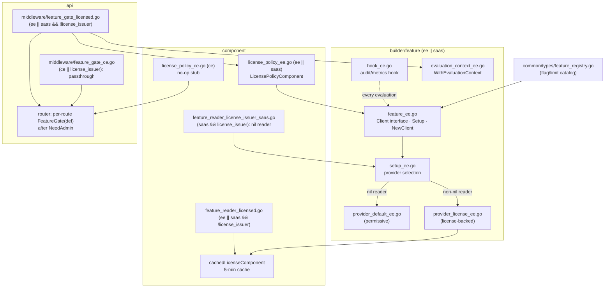
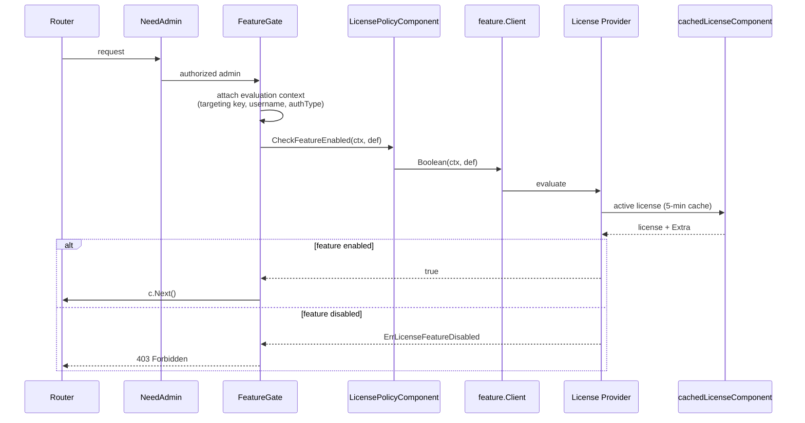

# Architecture Design: OpenFeature + License Feature Gating

## 1. Overview

### 1.1 Problem Statement

CSGHub sells per-deployment licenses that define which capabilities a customer
is entitled to. Today there is no standard mechanism for business code to ask
"is this capability enabled for this deployment?" at runtime. Capability checks
are either hard-coded per edition (compile-time Go build tags `ce`/`ee`/`saas`)
or scattered across call sites. What is missing is a **runtime feature-flag
access layer** that reads entitlements from the customer License and exposes
them to business code in a uniform way.

### 1.2 Business Motivation

- A single EE/SaaS binary should serve customers with different entitlements;
  enabling a capability is a license change, not a code change or redeploy.
- The SaaS portal and API clients need an actionable signal when a gated
  endpoint is called without entitlement, so they can show "Feature not
  enabled / Upgrade your license."
- Future operational kill switches (pause a capability during an incident)
  need a runtime flag surface that this design makes possible.

### 1.3 Technical Goals

1. **Centralized configuration**: all feature-flag names, limit names,
   defaults, categories, and statuses live in one registry as the single
   source of truth.
2. **Hybrid gating**:
   - **Middleware** for route-level feature flags (blocks whole API groups).
   - **Component layer** for operation-level flags and numeric limits.
3. **Backward compatibility**: existing licenses without `Extra` data return
   caller-supplied defaults, so they keep working unchanged.
4. **Standard surface**: expose capabilities through the vendor-neutral
   [OpenFeature](https://openfeature.dev/) SDK, so future providers
   (e.g. flagd for per-tenant targeting or ops kill switches) can be added
   without touching business call sites.

### 1.4 Scope

This document covers the full-release architecture of the OpenFeature +
License gating layer:

- The centralized feature registry (`common/types/feature_registry.go`).
- The OpenFeature client wrapper and providers (`builder/feature/`).
- The license policy component and license-status reader wiring
  (`component/license_policy_*.go`, `component/feature_reader_*.go`).
- The route-level gate middleware (`api/middleware/feature_gate_*.go`) and
  its attachment on `/api/v1/admin/audit_logs`.
- The `feature.audit_log` flag as the enforced reference example.

### 1.5 Non-Goals

- **Compile-time code isolation**: edition differences already handled by Go
  build tags (`ce`/`ee`/`saas`) remain as-is. OpenFeature is a runtime layer
  on top, not a replacement.
- **Security boundaries**: feature gating is an entitlement signal, not an
  access-control mechanism. Authentication/authorization middleware stays the
  security boundary and always runs before the gate.
- **Per-tenant targeting**: entitlements are deployment-wide. The evaluation
  context carries caller identity so a future targeting provider can consume
  it, but no targeting provider ships in this release.
- **Enforcement of the deferred flags/limits** listed in §10.4.

---

## 2. Background and Context

### 2.1 Go Static Binary and Editions

CSGHub ships as a Go static binary. Three editions are produced from one
codebase via build tags:

| Tag combination | Edition | License posture |
|---|---|---|
| `!ee && !saas` (`ce`) | Community Edition | No license concept; everything permissive |
| `ee` | Enterprise Edition | Holds a customer license; fail-closed |
| `saas && !license_issuer` | License-consuming SaaS | Holds a customer license; fail-closed |
| `saas && license_issuer` | License-issuing SaaS (e.g. cn-saas) | Issues licenses to customers; holds none itself; permissive |

### 2.2 Existing License Mechanism

- `component/license*.go` manages license lifecycle (create, import, update,
  delete) and stores license rows in the database. `License.Extra` is a JSON
  column for extension data.
- A shared `cachedLicenseComponent` (5-minute TTL) already exists to serve
  license status lookups cheaply; it is invalidated on `ImportLicense`,
  `UpdateLicense`, and `DeleteLicenseByID` in the handling process. The cache
  is process-local, so an imported license may take up to five minutes to be
  observed by other replicas (with the TTL still clamped to the license
  expiry). This bounded staleness is intentional because license imports are
  infrequent; cross-replica invalidation is deferred until a faster cutover is
  required.
- `api/middleware/license.go` (`CheckLicense`) demonstrates the established
  middleware pattern: the middleware collection constructs its component
  dependencies internally, and routes consume a prebuilt
  `middlewareCollection.License.Check` handler.

### 2.3 Layered Architecture Constraints

The repo enforces `handler -> component -> builder` layering. Two constraints
shape this design directly:

- **OpenFeature is a third-party SDK**, so all of its touchpoints (providers,
  hooks, client wrapper, context propagation) live in the builder layer.
- **Build-tag scoping rules**: feature-gate code is scoped to `ee || saas`;
  the `license_issuer` tag may appear in the api, middleware, and component
  layers but **never in `builder/`**. CE compiles only no-op stubs and never
  links the OpenFeature SDK.

### 2.4 Backward Compatibility Requirement

Deployed customers hold signed licenses issued before this feature existed.
Those licenses have no `Extra` payload. The design must keep them working
unchanged: a missing flag or limit falls back to the registry default, never
to a hard failure. Issuers validate `Extra` strictly before signing: malformed
JSON, unknown top-level fields, unknown feature/limit keys, and known keys with
a mismatched value type are rejected. Consumers validate imported licenses with
a forward-compatible policy: malformed JSON and known keys with a mismatched
value type are rejected, while unknown fields and keys are tolerated and
surfaced as warnings (see §7). This lets a license signed by a newer issuer —
whose registry shipped additional keys before the customer's server upgrades —
still import instead of blocking renewal.

---

## 3. Architecture Principles

| Principle | Reason | Impact |
|---|---|---|
| **Centralized feature registry** | One catalog of all flags/limits/defaults prevents raw flag strings from scattering across business code | Business code references `types.FeatureDefinition` values; `common/types/feature_registry.go` is the single source of truth |
| **Builder-layer isolation of the OpenFeature SDK** | Third-party SDKs belong in the builder layer per repo architecture | Middleware and components never import `openfeature`; they depend on `feature.Client` / `feature.WithEvaluationContext` |
| **`license_issuer` never in builder** | Provider selection must not depend on an api/component-layer tag | Provider selection is driven at runtime by whether a `LicenseStatusReader` is injected (nil → permissive default, non-nil → license-backed) |
| **Hybrid gating: middleware for routes, component for operations** | Route-level flags block whole API groups cheaply; numeric limits and operation-level flags need business context | Two enforcement surfaces, one policy component |
| **Gate after auth/authorization** | Non-admin callers must not probe license entitlements through response differences | `FeatureGate` attaches after `NeedAdmin` on each gated route |
| **Per-route gate attachment, not global path matching** | A global path-matching registry runs on every request and silently un-gates a feature when a route path is renamed (fail-open drift) | `grep FeatureGate(` recovers the gated-route list; ungated routes pay zero overhead |
| **Fail-closed where a license is expected, permissive where it is not** | EE and license-consuming SaaS must not grant entitlements without a license; CE and license-issuing SaaS hold no license by design | No active license → restrictive defaults (`false`/`0`) in licensed editions; permissive no-ops in CE / license-issuing SaaS |
| **403 on gate rejection** | For a licensed B2B product the customer knows the feature exists; 403 lets the portal show "Upgrade your license" | `ErrLicenseFeatureDisabled` maps to 403; other policy errors map to 500 |
| **Validate `License.Extra` at write time** | Issuers must fail loudly on unknown fields/keys so typos are not signed; consumers must stay forward-compatible with licenses from newer issuers | `types.ValidateLicenseExtraForIssue` runs on create/update before signing; `types.ValidateLicenseExtraForImport` runs on import/verify |
| **Observability without touching call sites** | Gate decisions need audit/metrics visibility | A global OpenFeature hook logs failures and increments `csghub_feature_flag_evaluations_total{flag,reason,value}` |

---

## 4. High-Level Architecture



**Request flow (licensed edition):**



---

## 5. Component Responsibilities

### 5.1 Feature Registry — `common/types/feature_registry.go`

The single source of truth for all flags and limits. Every capability is a
`FeatureDefinition{Key, Type, DefaultValue}`:

- **Boolean flags** use the `feature.*` namespace; **numeric limits** use
  `quota.*`.
- Business code never uses raw strings; it references these definitions.

This release ships one entry:

| Definition | Key | Type | Default | Enforcement |
|---|---|---|---|---|
| `FeatureAuditLog` | `feature.audit_log` | boolean | `true` | enforced at the audit-log route |

The license issuer exposes the registered catalog to the portal through
`GET /api/v1/licenses/management/features`. The endpoint is available only in
the `saas && license_issuer` build and inherits the management route group's
administrator requirement. It returns each definition's key, type, default
value, and server-localized name and description. Localization is selected by
`Accept-Language`; translation IDs remain internal to the server.

Only features with implemented enforcement belong in the catalog. Adding a
feature requires adding the Go definition and catalog entry, implementing its
enforcement point, adding `en-US`/`zh-CN`/`zh-HK` translations, and adding
catalog, compatibility, and enforcement tests.

### 5.2 Feature Client — `builder/feature/feature_ee.go` (`ee || saas`)

The only OpenFeature touchpoint consumed by upper layers:

```go
type Client interface {
    Boolean(ctx context.Context, def FeatureDefinition) (bool, error)
    Int(ctx context.Context, def FeatureDefinition) (int, error)
}
```

Taking `FeatureDefinition` instead of raw strings guarantees all evaluated
flags are declared in the registry.

- `Setup(config, reader)` registers the provider and global hooks exactly
  once (`sync.Once` + stored error). Called from
  `NewLicensePolicyComponent`, which every gate consumer constructs.
- `NewClient()` returns a cheap handle over the OpenFeature global registry
  (`openfeature.NewClient(domain)`); the SDK itself is the registry, so no
  project-level singleton map is needed.

### 5.3 Provider Selection — `builder/feature/setup_ee.go`

Provider selection is a **runtime decision driven by the injected reader**,
which is how the builder package stays free of the `license_issuer` tag:

- **nil `LicenseStatusReader`** → `provider_default_ee.go`
- **non-nil reader** → `provider_license_ee.go`

The component layer decides which reader to inject per edition (§5.6).

### 5.4 License-Backed Provider — `builder/feature/provider_license_ee.go`

Implements `openfeature.FeatureProvider`:

1. Resolve the active license via the injected `LicenseStatusReader`.
2. Parse `License.Extra` into `LicenseExtra`.
3. Evaluation behavior:
   - Active license + explicit value → that value.
   - Active license + missing flag/limit → `FeatureDefinition.DefaultValue`.
   - **No active license → restrictive defaults** (`false` for booleans, `0`
     for ints).

`License.Extra` uses separate validation policies: `ValidateLicenseExtraForIssue`
strictly validates create/update payloads before signing, while
`ValidateLicenseExtraForImport` rejects malformed JSON and known-key type
mismatches but tolerates unknown fields and keys with warnings. This keeps a
license signed by a newer issuer importable on an older server (forward
compatibility); evaluation already falls back to defaults for any key this
server does not enforce.

### 5.5 Permissive Default Provider — `builder/feature/provider_default_ee.go`

Returns `FeatureDefinition.DefaultValue` for every evaluation; no database
access. Selected when a nil reader is injected — i.e. license-issuing SaaS
variants (`saas && license_issuer`, e.g. cn-saas), which issue licenses but
hold none themselves. A license-backed provider would fail closed on every
check there.

### 5.6 License Policy Component and Reader Wiring

- **`component/license_policy_ee.go`** (`ee || saas`): business-facing
  policy. `NewLicensePolicyComponent(config)` builds the edition's
  `LicenseStatusReader`, calls `feature.Setup`, and returns a component whose
  `CheckFeatureEnabled` maps a disabled flag to
  `errorx.ErrLicenseFeatureDisabled`. It depends on `feature.Client` like any
  other builder client.
- **`component/license_policy_ce.go`** (`!ee && !saas`): no-op stub;
  `CheckFeatureEnabled` always succeeds, so route registration stays uniform.
- **`component/feature_reader_licensed.go`** (`ee || (saas && !license_issuer)`):
  returns the active `LicenseStatusResp` through a cached entitlement reader.
  The response still contains license metadata beyond feature entitlements.
  The cache is shared by consumers in one process; successful mutations
  invalidate that process immediately, while other replicas converge within
  the bounded TTL.
- **`component/feature_reader_license_issuer_saas.go`**
  (`saas && license_issuer`): returns a nil reader, selecting the permissive
  default provider.

### 5.7 Evaluation Context Propagation — `builder/feature/evaluation_context_ee.go`

`WithEvaluationContext` is the single OpenFeature SDK touchpoint for context
propagation. The middleware copies caller identity (user UUID as targeting
key, username, auth type) from the Gin context into the OpenFeature
transaction context. The license provider ignores these attributes —
entitlements are deployment-wide — but the channel exists from day one: a
future targeting provider (e.g. flagd for per-tenant rollout) needs no
interface change.

### 5.8 Audit/Metrics Hook — `builder/feature/hook_ee.go`

A global OpenFeature hook logs evaluation failures and increments
`csghub_feature_flag_evaluations_total{flag,reason,value}` on every
evaluation, giving audit visibility into gate decisions without touching
business call sites.

### 5.9 Route-Level Gate Middleware — `api/middleware/feature_gate_*.go`

The middleware package constructs its own policy component, following the
established `CheckLicense` pattern:

- **`feature_gate_licensed.go`** (`ee || (saas && !license_issuer)`) holds
  the real gate. `NewFeatureGate(config)` constructs the
  `LicensePolicyComponent` and returns a factory
  `func(def types.FeatureDefinition) gin.HandlerFunc`. It does **not** import
  the OpenFeature SDK; context propagation goes through
  `feature.WithEvaluationContext`.
- **`feature_gate_ce.go`** (`(!ee && !saas) || license_issuer`) provides
  no-op passthroughs so route registration stays uniform in editions without
  license gating.

Gate behavior on rejection: `ErrLicenseFeatureDisabled` → **403 Forbidden**
(an actionable entitlement signal for the portal; a per-flag 404 override can
be added later if product wants to hide endpoint existence); any other policy
error → 500.

### 5.10 Per-Route Gate Attachment

The factory is stored on the middleware collection next to `License.Check`:

```go
// api/router/api.go
featureGate, err := middleware.NewFeatureGate(config)
if err != nil {
    return nil, fmt.Errorf("error creating license feature gate: %w", err)
}
middlewareCollection.License.FeatureGate = featureGate
```

Gates attach explicitly at the route registration site, after
auth/authorization middleware:

```go
adminGroup.GET("/audit_logs",
    middlewareCollection.Auth.NeedAdmin,
    middlewareCollection.License.FeatureGate(types.FeatureAuditLog),
    auditLogHandler.ListAuditLogs)
```

Construction errors fail fast at startup rather than surfacing as deferred
500s at request time.

---

## 6. Runtime Behavior per Edition

| Edition | Middleware file | Policy component | Reader | Provider | No license | Missing flag |
|---|---|---|---|---|---|---|
| CE (`!ee && !saas`) | passthrough | no-op stub | — | — (SDK not linked) | allow | allow |
| EE | licensed | real | cached license | license-backed | restrictive (`false`/`0`) | registry default |
| SaaS, license-consuming | licensed | real | cached license | license-backed | restrictive | registry default |
| SaaS, license-issuing | passthrough | real (permissive provider) | nil | default | allow | registry default |

Additional runtime properties:

- **License cache staleness**: license status is cached with a TTL clamped to
  license expiry, so an expired license is never served. When no license is
  active but a future license exists, the miss is cached for the smaller of
  one minute and the time remaining until its `StartTime`. A miss with no
  upcoming license is not cached, and concurrent misses are not coalesced.
  The route middleware and the license handler share one `cachedLicenseComponent`
  instance that is additionally invalidated on `ImportLicense`/`UpdateLicense`/
  `DeleteLicenseByID`/`CreateLicense`. The feature provider reads through a
  separate `cachedLicenseStatusReader` with the same TTL-cache semantics.
  License imports are rare, so a license change made by another replica
  propagates within the cache TTL rather than via a per-evaluation DB query.
  Revisit this window before gating high-volume services (see §10.4).
- **Evaluation context**: every gated request carries caller identity in the
  OpenFeature transaction context; current providers ignore it.
- **Failure semantics on lookup error**: if the license status lookup fails
  (e.g. DB error), the provider returns the registry default tagged with an
  OpenFeature error reason. The SDK surfaces that error, so the route feature
  gate rejects the request with HTTP 500 (fail-closed). See §9 for the
  candidate refinement.

---

## 7. Data Model: `License.Extra`

`LicenseExtra` (`common/types/license_extra.go`) is the JSON payload carrying
entitlements inside a signed license:

- `features` — map of `feature.*` keys to booleans.
- `limits` — map of `quota.*` keys to integers.
- Unknown top-level keys outside the struct are ignored (existing payloads
  such as `{"token_limit": 10}` keep working).
- `types.ValidateLicenseExtraForIssue` runs before license create/update
  signing. It rejects malformed JSON, unknown top-level fields, unknown
  `feature.*`/`quota.*` keys, and known keys with a mismatched value type, so
  typos are not permanently signed into a license.
- `types.ValidateLicenseExtraForImport` runs when importing or verifying a
  signed license. It rejects malformed JSON and known keys with a mismatched
  value type, but tolerates unknown top-level fields and unknown
  `feature.*`/`quota.*` keys as warnings. This is the consumer
  forward-compatibility contract: licenses signed by a newer issuer can still
  import on an older server.
- Runtime parsing uses the same registry boundary: known keys are decoded
  strictly, while unknown future keys are ignored before OpenFeature
  evaluation, so an unknown future value cannot turn a known flag into a
  parse-error 500.

---

## 8. Enforcement Points

The current release ships exactly one enforcement point as the reference
example:

| Flag / Limit | Enforcement location |
|---|---|
| `FeatureAuditLog` | `middlewareCollection.License.FeatureGate` on `/api/v1/admin/audit_logs`, after `NeedAdmin` (api/router/api_ee.go, api/router/api_saas.go) |

Before a future `quota.max_users` definition and enforcement land, user admission and creation must
be implemented as one atomic store operation. A separate `CountUsers` check
followed by creation is not safe because concurrent registrations can both
observe capacity and exceed the licensed quota. The admission operation may
use a locked quota row, a PostgreSQL advisory lock, or a serializable
transaction with bounded retry; the concrete choice belongs to that feature.

---

## 9. Key Trade-Offs and Risks

- **Global OpenFeature provider state**: the SDK's registry is process-global
  by design. Part 1 registers one named provider (`"license"`) in the API
  process at startup. Other services do not initialize the runtime yet.
- **Per-route attachment vs global path matching** (decided): a global
  registry middleware was rejected because it runs on every request and its
  stringly-typed path mapping can silently un-gate a feature when a route
  path is renamed (fail-open drift). Per-route attachment cannot drift, adds
  zero overhead to ungated routes, and runs after `NeedAdmin`. The cost is
  that gated routes are declared in two places (registry + route site);
  `grep FeatureGate(` recovers the list.
- **403 vs 404 on rejection** (decided): 403 is preferred for a licensed B2B
  product — the customer knows the feature exists, and the portal can show an
  upgrade prompt. A per-flag 404 override remains possible via the registry.
- **Fail-closed EE behavior change**: EE deployments without an active
  license now receive 403 on gated routes (previously reachable). This is the
  intended fail-closed posture and is documented in the MR description.
- **Failure semantics on error**: a failed license lookup or malformed known
  entitlement returns the registry default with an OpenFeature error reason.
  The SDK propagates that error, so the current route outcome is HTTP 500.
- **Middleware vs component enforcement overlap**: some features may
  eventually be gated at both route and operation level. The route gate is
  authoritative where both exist; component-level checks add numeric-limit
  and operation granularity the route gate cannot express.
- **Legacy middleware composition**: a feature-gated route must not also rely
  on `License.Check`. Its current no-license behavior aborts with HTTP 200 and
  can prevent the feature gate from returning the documented HTTP 403.
- **Runtime provider selection is fail-open on miswiring**: because nil
  reader selects the permissive provider, an EE build that accidentally
  injected nil would be permissive rather than closed. The wiring is
  compile-time per edition, so this is guarded by build-tag structure and
  tests rather than by a runtime check.

---

## 10. Testing, Verification, and Future Work

### 10.1 Tests

- `builder/feature/`: `feature_ee_test.go`, `provider_license_ee_test.go`,
  `hook_ee_test.go`, `evaluation_context_ee_test.go`.
- `api/middleware/`: `feature_gate_licensed_test.go` includes the complete
  reader → provider → client → policy → middleware → HTTP path;
  `feature_gate_ce_test.go` covers the passthrough edition.
- `component/license_cache_test.go`: cache TTL clamped to license validity;
  an already-expired license status is not cached.
- `component/license_saas_test.go` + `api/handler/license_{ee,saas}_test.go`:
  `License.Extra` validation failures return `errorx.ErrInvalidLicenseExtra`
  (component) and HTTP 400 (handlers) for create/update/import/verify.
- `api/router/feature_gate_guardrail_test.go`: source-scan ensuring
  `/api/v1/admin/audit_logs` stays gated behind `FeatureGate` in `api_ee.go`
  and `api_saas.go`.
- Tests for each enforced component operation as enforcement points land.

### 10.2 Verification Matrix

- `make test GO_TAGS=ce` / `ee` / `saas`.
- Manually compile the combined `saas license_issuer license_federation`
  variant; current CI does not protect this tag combination.
- `make lint` across the same editions.
- Manual end-to-end:
  - Import a license with `feature.audit_log: false`; verify
    `/api/v1/admin/audit_logs` returns **403** with a clear error body.
  - Verify CE build remains permissive.
  - Verify existing licenses without `Extra` keep working.

### 10.3 File Inventory

**New files**

- `common/types/license_extra.go`, `common/types/feature_registry.go`
- `common/errorx/error_license.go` (extended: `ErrLicenseFeatureDisabled`,
  `ErrLicenseLimitExceeded`, `ErrInvalidLicenseExtra`)
- `builder/feature/`: `feature_ee.go`, `setup_ee.go`,
  `provider_license_ee.go`, `provider_default_ee.go`, `hook_ee.go`,
  `evaluation_context_ee.go` (+ `_ee_test.go` counterparts)
- `component/license_policy_ee.go` (`ee || saas`),
  `component/license_policy_ce.go` (CE no-op stub)
- `component/feature_reader_licensed.go` (`ee || (saas && !license_issuer)`),
  `component/feature_reader_license_issuer_saas.go` (`saas && license_issuer`)
- `api/middleware/feature_gate_licensed.go` (`ee || (saas && !license_issuer)`),
  `api/middleware/feature_gate_ce.go` (`(!ee && !saas) || license_issuer`),
  + tests

**Modified files**

- `go.mod` / `go.sum` (OpenFeature SDK)
- `component/license_saas.go` (`ValidateLicenseExtraForIssue` on
  create/update, `ValidateLicenseExtraForImport` on import/verify, mapped to
  `ErrInvalidLicenseExtra`)
- `component/license_cache.go` (cache TTL bounded by license validity)
- `api/handler/license_ee.go`, `api/handler/license_saas.go`
  (validation errors map to 400)
- `api/middleware/authenticator.go` (`License.FeatureGate` collection field)
- `api/router/api.go`, `api/router/api_ee.go`, `api/router/api_saas.go`

### 10.4 Future Work

- **Part-2 preconditions for cross-service rollout** (from architecture
  review): before gating features in the User/AIGateway/Runner/Accounting
  services, the following must be settled —
  - **Minimal entitlement snapshot**: the current reader avoids unrelated
    user-count work but still returns `LicenseStatusResp`, including key,
    company, email, and other metadata. Introduce a dedicated entitlement DTO
    before broad cross-service rollout.
  - **Per-service bootstrap contract**: today `feature.Setup` runs only in the
    API process; other services have their own routers and would silently fall
    back to SDK defaults (fail-open) unless each bootstrap explicitly
    constructs and injects the runtime. Provide an explicit
    `feature.Runtime`/`EntitlementPolicy` startup contract per service.
  - **Typed catalog**: Part 1 validates a canonical catalog at startup and
    rejects ad-hoc definitions at evaluation time. Longer term, replace
    `FeatureDefinition{Type, DefaultValue any}` with per-domain
    `BoolDefinition`/`IntDefinition` entries, plus compatibility policy fields
    (`legacyDefault`, `noLicensePolicy`, `evaluationErrorPolicy`, owner,
    applicable service/edition). This is also the long-term home for the
    issuer↔consumer forward-compat policy that today lives in
    `ValidateLicenseExtraForIssue` and `ValidateLicenseExtraForImport`.
  - **Cross-replica license propagation**: within a process, license mutations
    invalidate the status cache immediately; across replicas, a license change
    propagates within the cache TTL (≤ 5 minutes, clamped to license expiry).
    This is acceptable because license imports are rare. Before gating
    high-volume services where a faster cutover matters, add a versioned
    snapshot or pub-sub channel to invalidate caches across replicas.
  - **Automated enforcement inventory**: extend the route-gate guardrail into
    a full inventory test for enforced flags and component-level rules (old
    license, missing key, explicit true/false, no license, provider error).
- **Ops kill switches via flagd (multi-provider end-state)**: register a
  flagd provider alongside the license provider using the OpenFeature
  multi-provider with AND semantics — a feature is enabled when it is both
  licensed and not operationally disabled. This gives runtime kill switches
  (e.g. pause finetune, disable registration during an incident) across all
  services without redeploys. The evaluation-context propagation in this
  release is the prerequisite for any per-tenant targeting later.
- Web UI for editing `License.Extra` JSON in the SaaS license issuer
  (write-time validation flags malformed JSON and known-key type mismatches;
  unknown keys produce a warning).
- Per-flag failure policy (`fail-open`/`fail-closed`) on `FeatureDefinition`.
- Deferred flags/limits from the original issue, to be added as registry
  entries + enforcement points when product confirms them in scope:
  `feature.user_registration`, `feature.model_inference`,
  `feature.model_finetune`, `feature.multi_cluster`, `feature.sso_ldap`,
  `feature.advanced_permissions`, `quota.max_models`, `quota.max_repos`,
  `quota.max_clusters`, `quota.max_runners`. Enforcement for the
  `quota.max_users` (user registration check in `user/component/user.go`) is
  likewise deferred and is not currently registered or issuable.
