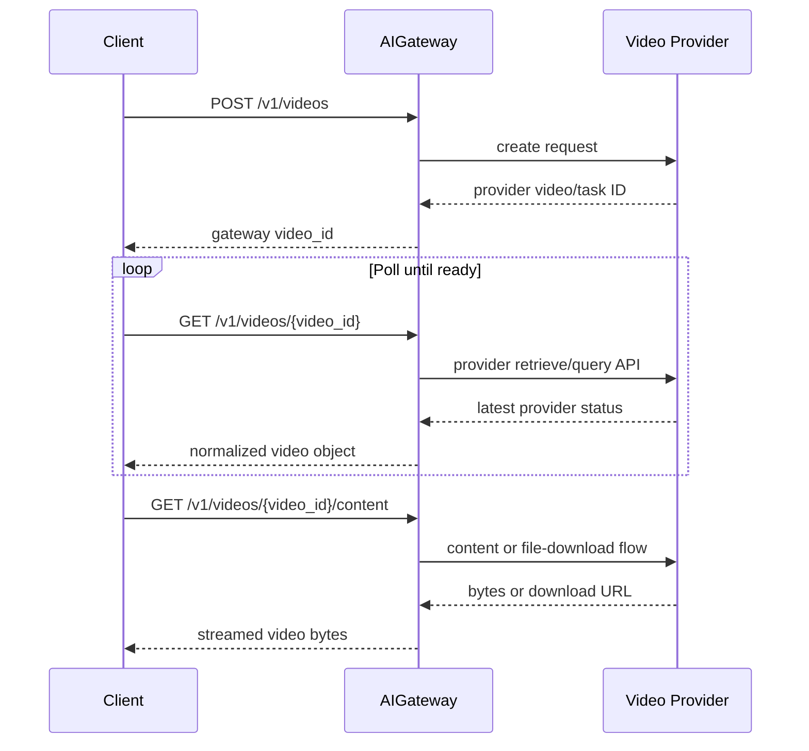

# AIGateway Video API User Guide

## What It Does

AIGateway video APIs provide one OpenAI-compatible async workflow for:

- text-to-video
- image-to-video

You always use the same three endpoints:

```text
POST /v1/videos
GET /v1/videos/{video_id}
GET /v1/videos/{video_id}/content
```

The gateway hides provider-specific details such as task IDs, polling APIs, and download URL flows.

For the exact request and response contract, see [api.md](./api.md).

## End-To-End Flow



## Before You Start

Required:

- AIGateway base URL
- valid API key or access token
- a video-capable `model`

Recommended shell variables:

```bash
export AIGATEWAY_BASE_URL="https://your-aigateway.example.com"
export AIGATEWAY_API_KEY="replace_with_api_key"
```

## Size Compatibility

The public API uses the OpenAI-compatible `size` field in `{width}x{height}` format.

Examples:

- `1280x720`
- `720x1280`
- `1920x1080`
- `1080x1920`

If the selected backend is MiniMax, AIGateway normalizes supported values to MiniMax-native `resolution` values:

- `1280x720` and `720x1280` -> `720P`
- `1920x1080` and `1080x1920` -> `1080P`

MiniMax-native values `720P`, `768P`, and `1080P` are also accepted for compatibility. Unsupported sizes such as `1024x1792` fail fast with `invalid_request_error`.

## Example 1: Text to Video

Create:

```bash
curl -X POST "$AIGATEWAY_BASE_URL/v1/videos" \
  -H "Authorization: Bearer $AIGATEWAY_API_KEY" \
  -H "Content-Type: application/json" \
  -d '{
    "model": "video-model",
    "prompt": "A futuristic train moving through a snowy mountain landscape",
    "size": "1280x720",
    "seconds": 5
  }'
```

Typical create response:

```json
{
  "id": "video_8b1d8d4f7c5b4d58b4d7f3a7f8c9d001",
  "object": "video",
  "status": "queued"
}
```

Save the returned `id` as `VIDEO_ID`.

## Example 2: Image to Video With `image_url`

```bash
curl -X POST "$AIGATEWAY_BASE_URL/v1/videos" \
  -H "Authorization: Bearer $AIGATEWAY_API_KEY" \
  -H "Content-Type: application/json" \
  -d '{
    "model": "image-video-model",
    "prompt": "Turn this still frame into a slow cinematic dolly shot",
    "size": "1280x720",
    "seconds": 5,
    "input_reference": {
      "image_url": "https://example.com/frame.png"
    }
  }'
```

## Example 3: Image to Video With Uploaded File

```bash
curl -X POST "$AIGATEWAY_BASE_URL/v1/videos" \
  -H "Authorization: Bearer $AIGATEWAY_API_KEY" \
  -F "model=image-video-model" \
  -F "prompt=Animate this still frame into a cinematic shot" \
  -F "size=1280x720" \
  -F "seconds=5" \
  -F "input_reference=@frame.png;type=image/png"
```

Supported uploaded image content types:

- `image/jpeg`
- `image/png`
- `image/webp`

Provider note:

- Some provider-native backends do not support every public image-reference shape.
- The internal LightX2V backend supports uploaded images and JSON `image_url`.
- The internal LightX2V backend does not support JSON `input_reference.file_id`.
- The internal LightX2V backend still accepts text-only multipart requests; AIGateway converts those into the backend's normal JSON create request when no uploaded image is present.
- The current internal LightX2V-backed OpenCSG Wan model targets are `Wan-AI/Wan2.2-T2V-A14B` for text-to-video and `Wan-AI/Wan2.2-I2V-A14B` for image-to-video.

## Poll Generation Status

Use the gateway-owned `video_id` from the create response.

```bash
curl "$AIGATEWAY_BASE_URL/v1/videos/$VIDEO_ID" \
  -H "Authorization: Bearer $AIGATEWAY_API_KEY"
```

Example in-progress response:

```json
{
  "id": "video_8b1d8d4f7c5b4d58b4d7f3a7f8c9d001",
  "object": "video",
  "status": "in_progress"
}
```

Example completed response:

```json
{
  "id": "video_8b1d8d4f7c5b4d58b4d7f3a7f8c9d001",
  "object": "video",
  "status": "completed"
}
```

Recommended polling behavior:

- start with 10 seconds
- back off gradually for long-running jobs
- stop polling when status becomes `completed`, `failed`, or `cancelled`

## Download Result

Once status is `completed`, download the final video:

```bash
curl -L "$AIGATEWAY_BASE_URL/v1/videos/$VIDEO_ID/content" \
  -H "Authorization: Bearer $AIGATEWAY_API_KEY" \
  -o output.mp4
```

## Download Variants

If the downstream backend supports variants, pass `variant` through:

Thumbnail:

```bash
curl -L "$AIGATEWAY_BASE_URL/v1/videos/$VIDEO_ID/content?variant=thumbnail" \
  -H "Authorization: Bearer $AIGATEWAY_API_KEY" \
  -o thumbnail.bin
```

Spritesheet:

```bash
curl -L "$AIGATEWAY_BASE_URL/v1/videos/$VIDEO_ID/content?variant=spritesheet" \
  -H "Authorization: Bearer $AIGATEWAY_API_KEY" \
  -o spritesheet.bin
```

Main video:

```bash
curl -L "$AIGATEWAY_BASE_URL/v1/videos/$VIDEO_ID/content?variant=video" \
  -H "Authorization: Bearer $AIGATEWAY_API_KEY" \
  -o output.mp4
```

## Error Handling

HTTP-level errors use the OpenAI-compatible `error` envelope:

```json
{
  "error": {
    "code": "invalid_request_error",
    "message": "input_reference must include file_id or image_url",
    "type": "invalid_request_error"
  }
}
```

Common cases:

- `invalid_request_error`: bad request shape or unsupported uploaded file type
- `unsupported_model`: selected backend cannot handle the requested video mode
- `content_policy_violation`: prompt rejected by moderation
- `not_found`: unknown video ID or video owned by another user
- `internal_error`: gateway or provider-side processing failure

Example:

- `selected model does not support input_reference.file_id`

## Practical Notes

- Treat `video_id` as opaque. Do not assume it matches a downstream provider ID.
- Use the same authenticated identity for create, polling, and content download.
- `input_reference` is optional. Without it, the request is text-to-video.
- For OpenAI-compatible downstream providers, AIGateway preserves unknown compatible JSON request fields instead of dropping them.
- The internal LightX2V adapter is only used for internal CSGHub deployed video models with runtime framework `lightx2v`.

## Minimal Workflow Script

```bash
VIDEO_ID=$(curl -s -X POST "$AIGATEWAY_BASE_URL/v1/videos" \
  -H "Authorization: Bearer $AIGATEWAY_API_KEY" \
  -H "Content-Type: application/json" \
  -d '{
    "model": "video-model",
    "prompt": "A calm drone shot over a waterfall",
    "seconds": 5
  }' | jq -r '.id')

while true; do
  STATUS=$(curl -s "$AIGATEWAY_BASE_URL/v1/videos/$VIDEO_ID" \
    -H "Authorization: Bearer $AIGATEWAY_API_KEY" | jq -r '.status')
  if [ "$STATUS" = "completed" ]; then
    break
  fi
  if [ "$STATUS" = "failed" ] || [ "$STATUS" = "cancelled" ]; then
    echo "video generation stopped with status=$STATUS"
    exit 1
  fi
  sleep 10
done

curl -L "$AIGATEWAY_BASE_URL/v1/videos/$VIDEO_ID/content" \
  -H "Authorization: Bearer $AIGATEWAY_API_KEY" \
  -o output.mp4
```
