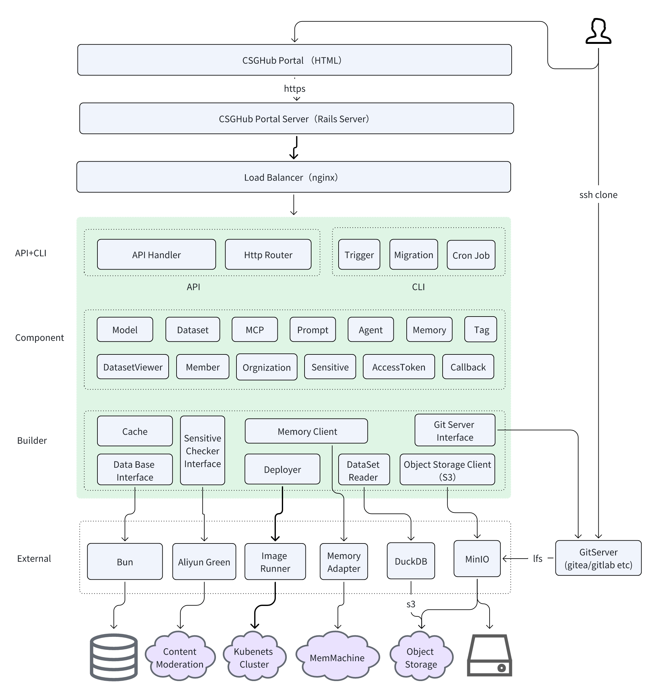

*[English](README_en.md) ∙ [简体中文](README_cn.md) ∙ [日本語](README_ja.md)*

CSGHub Server是开源、可信的大模型资产管理平台[CSGHub](https://github.com/OpenCSGs/CSGHub/)的服务端部分开源项目，提供基于REST API的模型、数据集等大模型资产管理功能。

## 主要功能：
- 用户和组织的创建和管理 
- 模型、数据集托管，支持以https或git协议的方式上传和下载模型、数据集文件
- 模型、数据集标签的自动生成
- 用户、组织、模型和数据的搜索
- 数据集文件在线预览，目前支持`.parquet`格式文件
- 文本、图像内容审核
- 单个文件下载，包括LFS文件下载
- 模型、数据集活跃度数据跟踪，如下载量、Like量等

## 功能演示
为了帮助您更直观地了解 CSGHub 的功能和使用方法，我们录制了演示视频。您可以通过观看视频，快速了解本项目的主要特性和操作流程。
- CSGHub功能演示如下，你也可以通过外部视频网站查看 [YouTube](https://www.youtube.com/watch?v=SFDISpqowXs) 或 [Bilibili](https://www.bilibili.com/video/BV1wk4y1X7G7/)
<video width="658" height="432" src="https://github-production-user-asset-6210df.s3.amazonaws.com/3232817/296556812-205d07f2-de9d-4a7f-b3f5-83514a71453e.mp4"></video>

更完整的功能请移步[OpenCSG官网](https://portal.opencsg.com/models)，体验"模型"和"数据集"的强大管理功能。

## 快速使用
系统资源需求: 4c CPU/8GB内存
请准备自行安装docker程序，本项目已在 Ubuntu22 环境下中完成测试。

您可以通过docker-compose快速部署本地化的csghub-server服务：
```shell
# API token 长度至少为128个字符，发往 csghub-server 的 http 请求需要将 API token 作为 Bearer token 来做身份验证
export STARHUB_SERVER_API_TOKEN=<API token>
mkdir -m 777 gitea minio_data
curl -L https://raw.githubusercontent.com/OpenCSGs/csghub-server/main/docker-compose.yml -o docker-compose.yml
docker compose -f docker-compose.yml up -d
```

## 技术架构
<div align=center>
  
</div>

### 可扩展可定制
- 支持不同的Git Server，如gitea，gitlab等
- 支持灵活配置LFS存储系统，可选择使用本地或第三方兼容S3协议的任意云存储服务
- 按需开启内容审核，选择任意第三方内容审核服务

## 技术规划
- [x] 支持更多Git Server: 目前内置了对gitea的支持，未来计划实现对主流Git仓库的支持
- [x] 支持Git LFS: Git LFS支持超大文件， 支持git命令操作和Web UI在线下载
- [x] 数据集在线预览: 数据集预览，支持LFS格式数据集的Top20/TopN加载预览
- [x] 模型和数据集自动打标签:：支持自定义元数据和自动化提取模型/数据集标签
- [x] S3协议兼容: 支持S3(MinIO)存储协议，更高的可靠性和存储性价比
- [ ] 模型格式转换: 主流模型格式转化
- [x] 模型一键部署: 支持与OpenCSG llm-inference集成， 一键启动模型推理

## License
我们使用Apache 2.0协议，协议内容详见`LICENSE`文件。

## 参与贡献
如果你想参与贡献，请根据 [贡献指南](docs/zh-CN/contributing.md) 来进行贡献。我们非常期待你的贡献！

## 致谢
本项目基于Gin, DuckDB, minio, gitea等开源项目，在此深深感谢他们的开源贡献！

### 联系我们
使用过程中的任何问题， 您可以通过以下任何一种方式联系我们：
1. 在github 发起issue
2. 扫描下方左侧微信二维码，添加微信小助手回复"开源"或者"open source"入群，加入我们的微信讨论群
3. 加入我们的Discord频道: [OpenCSG Discord Channel](https://discord.gg/bXnu4C9BkR)
4. 加入我们的Slack频道: [OpenCSG Slack Channel](https://join.slack.com/t/opencsghq/shared_invite/zt-2fmtem7hs-s_RmMeoOIoF1qzslql2q~A)
<div style="display:inline-block">

&nbsp;&nbsp;&nbsp;&nbsp;&nbsp;&nbsp;&nbsp;&nbsp;&nbsp;&nbsp;&nbsp;&nbsp;&nbsp;&nbsp;&nbsp;&nbsp;&nbsp;&nbsp;

  &nbsp;&nbsp;&nbsp;&nbsp;&nbsp;&nbsp;&nbsp;&nbsp;&nbsp;&nbsp;&nbsp;&nbsp;&nbsp;&nbsp;&nbsp;&nbsp;&nbsp;&nbsp;

</div>
