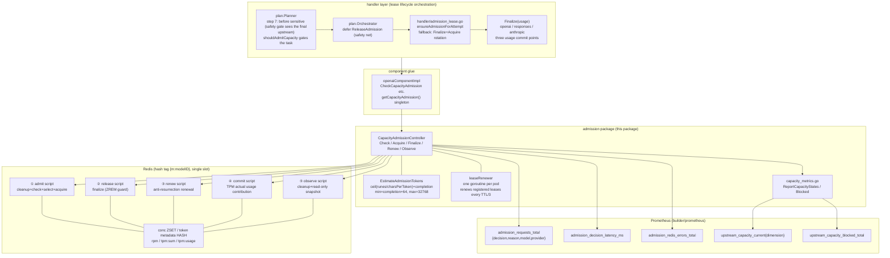
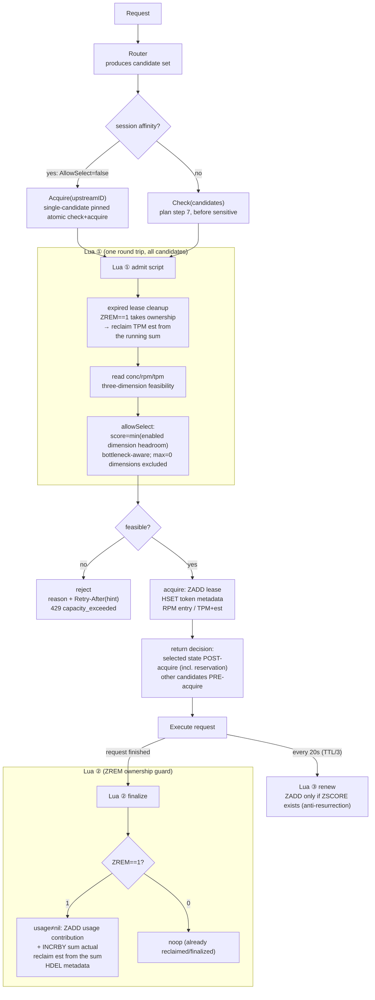
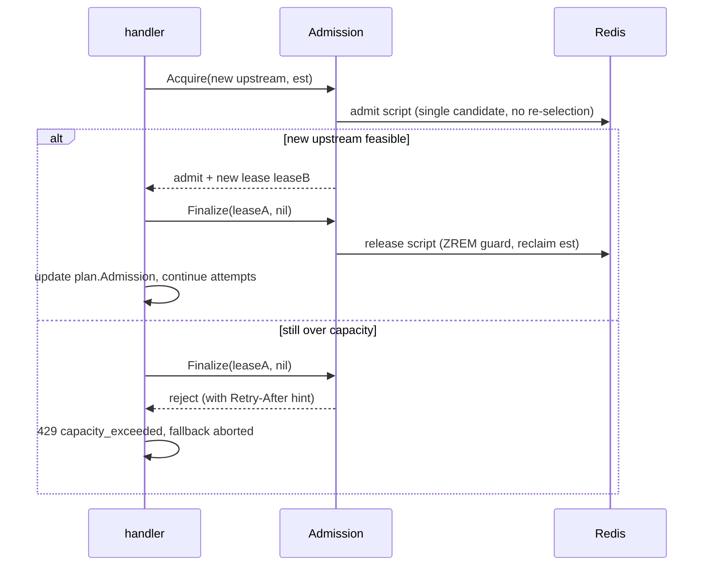
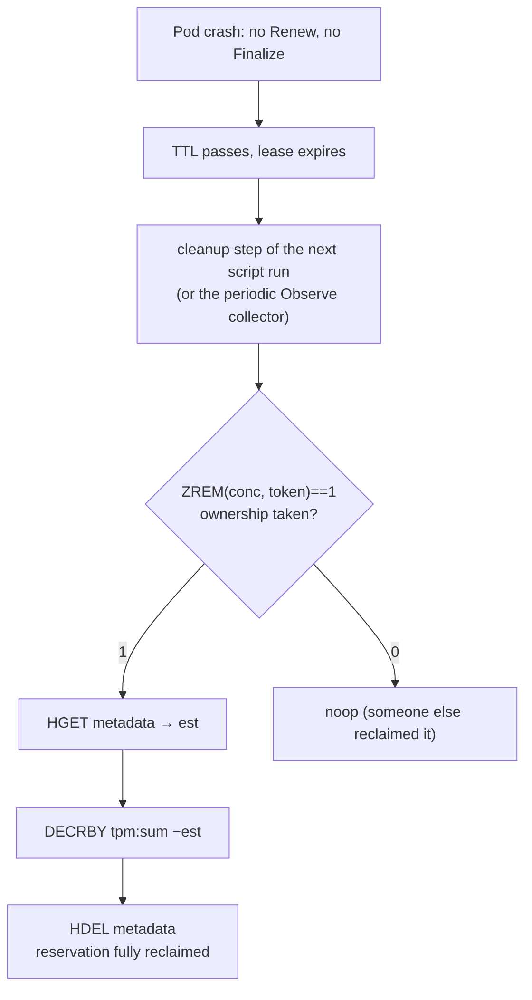

# AIGateway Capacity Admission

This package implements **per-upstream capacity admission** for the AIGateway,
based on a Redis distributed reservation lifecycle. It makes atomic admission
decisions against the four `CapacityPolicy` dimensions (Concurrency / RPM /
TPM / Queue) before a request reaches the runtime. v1 ships the first three
dimensions; Queue is a v2 extension point (see the end of this document).

**v1 in one sentence**: Redis-distributed reservation lifecycle providing
per-upstream Concurrency + RPM admission plus TPM pre-reservation (prompt
estimate + configurable completion reserve), with actual usage accounted
against a precise 60s sliding window.

## Core invariant (unified ownership guard)

> **Only an operation that successfully takes/releases Lease Ownership
> (`ZREM == 1`) may modify the reservation aggregate.**

acquire, cleanup and finalize all obey this guard: duplicate finalizes across
replicas, finalize racing expired-lease cleanup, finalize racing crash
recovery — each executes exactly once thanks to ZREM's atomicity, so TPM/RPM
aggregates are never double-decremented or double-released.

## Layering and boundaries

```
handler (openai / responses / anthropic / plan)
   │  only: lease rotation (fallback), 429 rendering, usage commit timing
   ▼
component (aigateway/component/capacity_admission.go, thin glue)
   │  OpenAIComponent interface adaptation, lazily-built controller
   ▼
admission (this package, all business logic)
   │  Check / Acquire / Finalize / Renew / Observe
   ▼
Redis (Lua scripts, single-slot atomic)
```

Two routing boundaries (Admission never replaces the Router):

- **Router owns the candidate set**: the candidate upstream set is decided by
  the Router (session affinity / weighted round-robin / ...); Admission only
  judges feasibility within that set.
- **Session affinity beats capacity re-selection**: affinity requests
  (`AllowSelect=false`, single candidate) go through `Acquire` and are
  rejected outright when full — **never re-selected**. A KV/prefix cache hit
  is worth more than one capacity-optimal pick. Plain requests go through
  `Check` and may be capacity-aware re-selected.
- **Availability fallback ≠ capacity re-selection**: when an upstream fails,
  the handler layer does `Finalize(old lease) + Acquire(new upstream)` — a
  pinned atomic re-acquire that never re-runs the selection (so the just
  failed upstream cannot be picked again) and never trusts the T0 snapshot.

## Architecture



## Redis data layout

All keys carry the hash tag `{m:<modelID>}`: every key of one model lands in
the same cluster slot (script atomicity) while different models spread across
slots (hotspot distribution — an intentional trade-off).

| Key | Type | Content |
|---|---|---|
| `aigateway:capacity:{m:<modelID>}:u:<id>:conc` | ZSET | concurrency leases: member=token, score=expiry ms (judged by Redis `TIME`) |
| `...:u:<id>:lease` | HASH | **token metadata** (per-lease-token reservation metadata): token → `"<est>:<acquire epoch second>"` (packed; under the sliding window the recorded window start is informational only — reclamation goes through the running sum) |
| `...:u:<id>:rpm` | ZSET | **sliding-window** request count: member=token, score=acquire ms; checks age out entries older than 60s, then ZCARD is the current RPM |
| `...:u:<id>:tpm:sum` | STRING | **sliding-window** running token total (reservation contributions + live usage contributions); EXPIRE refreshed on every write and by renew (so a live lease's reservation is never orphaned by key expiry) |
| `...:u:<id>:tpm:usage` | ZSET | committed usage contributions: member=`"<token>:<actual>"`, score=commit ms; aged out after 60s and subtracted from the sum **exactly** (member-wise ZREM, no LIMIT drift) |

## Semantics table

| Dimension | Check/Acquire | Acquire | Commit | Release | Expiry | Counted per |
|---|---|---|---|---|---|---|
| Concurrency | cur < max | ZADD lease | — | ZREM (guarded) | purge ZSET | upstream attempt |
| RPM (immutable accounting, sliding 60s) | in-window entries < max | ZADD (token, now) | — | — (never decremented) | ages out of the window | upstream attempt |
| TPM (**soft limit**, sliding 60s) | sum+est ≤ max | INCRBY sum est (**reservation contribution**, bound to the lease lifetime, never age-GC'd) | ZADD usage contribution + INCRBY sum actual | DECRBY sum est (guarded) | reservations reclaimed with their owner; usage ages out of the sum after 60s | upstream attempt |

TPM soft-limit semantics: estimate ≠ actual, both steps idempotent, net
effect = actual; usage=nil (no usable usage) = full reservation reclaim and
no commit. **The two contribution kinds have different lifetimes**:
reservation contributions are reclaimed explicitly with their lease (long
streams renew and refresh the sum TTL, so a reservation never evaporates);
usage contributions age out after 60s.

**Multimodal / est ≤ 0 (`types.AdmissionNoTPMEstimate`)**: the estimate is
decided in the handler adapter by a two-level precedence — **(1) policy-level
shortcut**: when NO candidate upstream enables `MaxTPM > 0` (the documented
"no TPM dimension" configuration) the TPM dimension cannot bind for any
request, so the text estimate is skipped entirely (zero hot-path estimation
work, zero pointless reservation writes); **(2) request-level guard**: when a
TPM limit IS configured but the request carries non-text content
(`types.MultimodalContentProvider`, implemented by every protocol request
type's `HasMultimodalContent()`; image generation always reports multimodal),
the text-based estimate would be fiction — skip the reservation for that
request. Only when neither hits is the reservation estimated from
PromptText. **Admission participation ≠ usage accounting, they are
orthogonal**: an est ≤ 0 request still commits its actual usage to the
sliding window at finalize, so the window sum always stays the true total
usage. The fallback's pinned `Acquire` re-acquires with
`ReservedTokens=0`, automatically staying in no-reservation mode.

**Task coverage**: every known modality participates in capacity admission —
text-estimatable endpoints (chat/responses/messages, embedding/rerank/speech
TTS) reserve from the text estimate; media endpoints (image/audio/ocr/
text-to-video) never reserve (gated by concurrency + RPM only).
text-to-video gates the submission request synchronously (an async task's own
lease lifecycle is a separate future MR).

**TPM accounting per modality class** — the multimodal decision means
"computing TPM for media requests is meaningless", so the two classes differ
deliberately:

- **Media endpoints (est ≤ 0)**: nothing enters the TPM window — no
  reservation at acquire, and their `actual` usage is never committed
  (these handlers' async usage goroutines do not finalize the admission
  lease). The window stays "true total usage" because media contributes
  nothing, by design.
- **Text-estimatable endpoints (embedding/rerank/speech)**: reserve `est`
  for the in-flight request (chat-like in-flight occupancy), but their
  `actual` usage is NOT committed — the Orchestrator safety net releases the
  lease with a full reservation reclaim, so the net window effect is zero
  (speech's Decision 2 generalizes here). For an embedding-dominated
  upstream, MaxTPM therefore behaves as a per-request occupancy limit
  (≈ concurrency × est), not a strict tokens/min meter. Use
  `EstimatePromptCharsPerToken`/`EstimateCompletionTokens` to size `est` if
  a tighter tokens/min bound is needed; true usage accounting for these
  modalities is future work.

## Normal request flow



## Availability fallback flow (handler layer)



## Pod crash recovery flow



## Retry-After

429 responses carry `Retry-After`, a **hint, not a capacity guarantee**:

- `rpm_exceeded` / `tpm_exceeded` → a sliding window has no fixed boundary;
  the hint is computed by the script as "seconds until the oldest blocked
  contribution leaves the window" (capacity frees up at that moment),
  falling back to `min(LeaseTTL, RetryAfterHintSeconds)` when undeterminable
- `concurrency_exceeded` → `min(LeaseTTL, RetryAfterHintSeconds)` (default 5s)
- multiple dimensions blocked merge into `capacity_exceeded` → the smallest
  positive hint across blocked dimensions, same fallback

## Redis failure semantics

- Default **fail-open**: requests are admitted when Redis is unavailable,
  recorded as `admission_requests_total{decision="fail_open"}` + warn.
- Optional fail-close (`FailOpen=false`): reject on failure.
- All Redis errors increment `admission_redis_errors_total{operation=check|finalize|renew|observe}`.

## Multi-replica (multi-pod) safety

- All state lives in Redis; Lua execution is atomic, so capacity is never
  oversold.
- Leases + renewal: a pod's registry disappears with the pod; self-heals
  within ≤TTL; the TPM reservation is reclaimed from the running sum by the
  cleanup step via the token metadata.
- Expiry is judged by the Redis server `TIME` (read inside the scripts),
  immune to application clock skew.
- finalize / cleanup are idempotent across replicas thanks to the ZREM
  ownership guard.

## Lua scripts (all single-slot atomic)

| Script | Constant | Responsibility |
|---|---|---|
| admit | `capacityAdmissionScript` | expired cleanup + read all candidates + bottleneck-aware selection + atomic acquire; also ages the sliding window |
| release | `capacityAdmissionReleaseScript` | finalize: ZREM guard → reclaim reservation from the running sum → HDEL |
| renew | `capacityAdmissionRenewScript` | anti-resurrection renewal (ZADD only if ZSCORE exists); refreshes sum/usage TTLs |
| commit | `capacityAdmissionCommitScript` | TPM actual usage as a ZSET contribution (member = lease token) + INCRBY the running sum (aged out after 60s) |
| observe | `capacityAdmissionObserveScript` | read-only: expired cleanup + sliding-window aging + per-upstream conc/rpm/tpm snapshot |

All five scripts are pre-loaded into the Redis script cache (SCRIPT LOAD) at
controller construction, so every request hits EVALSHA directly without the
first-call NOSCRIPT fallback.

## Metrics

| Metric | Type | Labels | Purpose |
|---|---|---|---|
| `csghub_aigateway_admission_requests_total` | Counter | decision(admit/reject/fail_open), reason, model, provider | admission decisions; accepted/rejected/rejection_reason derivable from labels |
| `csghub_aigateway_admission_decision_latency_ms` | Histogram | model | per-decision (one Redis round trip) latency |
| `csghub_aigateway_admission_redis_errors_total` | Counter | operation(check/finalize/renew/observe) | Redis failure observability |
| `csghub_aigateway_upstream_capacity_current` | Gauge | model, upstream_id, dimension(concurrency/rpm/tpm) | live capacity watermark (piggybacked on Check + refreshed by Observe) |
| `csghub_aigateway_upstream_capacity_blocked_total` | Counter | model, upstream_id, dimension | rejections per upstream per dimension |

## Configuration (`AIGateway.CapacityAdmission`)

| Setting | Default | Description |
|---|---|---|
| `LeaseTTLSeconds` | 60 | lease TTL; renewal interval = TTL/3 |
| `FailOpen` | true | admit on Redis failure |
| `EstimatePromptCharsPerToken` | 4 | prompt estimation coefficient |
| `EstimateCompletionTokens` | 1000 | completion reserve |
| `EstimateMaxTokens` | 32768 | reservation cap (overflow/monopolization protection) |
| `RetryAfterHintSeconds` | 5 | hint cap for concurrency rejections |

When no upstream has an enabled CapacityPolicy, zero Redis calls are made
(`Check`/`Acquire` return nil and the caller admits directly).

## Tests

- `capacity_admission_test.go`: miniredis unit matrix — normal
  acquire/finalize, failed release, double-finalize idempotency, crash
  recovery (running-sum DECRBY), renewal / anti-resurrection / renew
  refreshing the sum+usage TTLs, sliding-window aging and precision
  (no boundary burst / gradual release — these fail against a fixed-window
  implementation), fail-open/close, pinned never re-selects, selection score
  (max=0 excluded / all-unlimited tie), estimate clamp, key hash tags,
  **est ≤ 0 no TPM reservation** (concurrency+RPM only, no sum key / no
  metadata, skips the TPM gate and score, finalize still commits actual,
  MaxTPM-only upstream lifecycle), script preloading.
- `e2e_test.go`: sustained load against 3 models × 3 upstreams under a
  simulated clock (150 ticks ≈ 2.5 windows), mixing session affinity and
  round-robin routing; covers crashes / no-usage / long streams / failovers /
  double finalize / **multimodal (est=0, heavy actual usage committed)**;
  every 10 ticks reconciles **Observe snapshot vs raw Redis**, **Prometheus
  gauges vs Redis** and the **sliding-window ledgers vs Redis** (RPM =
  in-window acquires, TPM = un-reclaimed reservations + un-aged usage,
  including crash reclamation timing); final assertions: admitted ==
  released + crashed (no leaks), no session drift, rejections carry no lease.
- `types/multimodal_test.go` + `handler/admission_checker_adapter_test.go`:
  multimodal detection for all protocol request types (including images
  nested in tool_result), adapter behavior multimodal → no reservation /
  text → estimate, including the real pipeline parsed-body wrappers.

```sh
go test ./aigateway/component/admission/ -count=1
```

## v2: admission reservation queue (implemented)

Waiting is not a new execution model — it turns an admission reservation from
"occupy immediately" into "occupy after waiting". Full semantics live in
[queue.md](queue.md) and the `capacity_queue.go` header comment; highlights:

- **Configuration edge (documented)**: in queue mode `MaxConcurrency <= 0`
  means "unlimited execution slots" — the gate always passes, the queue
  never triggers, and the upstream behaves as if queueing were off. This
  can only arise from `CapacityPolicyDefaults.MaxConcurrency <= 0` (the
  admin update path validates `>= 1`); it is self-consistent, never a
  capacity leak, but operators should keep the default `> 0`.
- **Queue Mode Invariant (concurrency-only scheduling).** With queueing
  enabled (`MaxQueueDepth > 0 && QueueWaitSeconds > 0`), execution admission —
  direct admit, enqueue, dequeue, promote — depends ONLY on
  `currentConcurrency < MaxConcurrency`. RPM/TPM MUST NOT block enqueue,
  dequeue or promote; in queue mode they are accounting and observability
  dimensions (and the promote script structurally cannot read them: the
  ticket metadata only carries `maxConc`). Quota protection, if ever needed,
  is an admission-time input BEFORE the queue (the reserved
  `budget_exceeded` reason) — never a dequeue condition. Queue-OFF upstreams
  keep the v1 three-dimension semantics byte for byte.
- **Data structure**: one ZSET per upstream (`…:u:<id>:queue`),
  member = ticket uuid, score = `priority*1e13 + enqueue_ms` (high=0 first,
  FIFO within a priority); ticket metadata HASH carries
  `<prio>:<est>:<enqueueMs>:<waitDeadlineMs>:<maxConc>` (est is only used for
  the TPM pre-reservation written at promotion, never a gate; the claim
  deadline arrives as ARGV), so promote needs no policy lookup.
- **Unified queue discipline**: empty queue and feasible → direct admit;
  non-empty queue → everyone enqueues. **Starvation semantics**: sustained
  high-priority traffic can starve low-priority tickets — accepted and
  documented; aging is a deliberate non-goal.
- **Bounded HOL**: the promote gate is a single comparison (concurrency <
  max), so every slot release promotes the head; leases reclaimed by the
  expired-lease cleanup (crashed replicas) are picked up by the same script.
- **Three ownership transitions** (same ZREM guard invariant as v1):
  `Ticket→Lease` (promote grants a real lease with the claim-deadline TTL),
  `Lease→Finalize` (release+promote merged atomically — the freed slot goes
  straight to the head), `Ticket→Cancel` (timeout / disconnect / reroute
  share one idempotent dual-state script; the granted-lease branch also
  drops the RPM entry and reclaims the TPM reservation).
- **Multi-replica wake-ups**: promote PUBLISHes on the queue key (pattern
  subscription `aigateway:capacity:*:queue`) — point-to-point, no herd;
  Pub/Sub is acceleration only, correctness comes from the per-waiter
  fallback poll (each tick also drives one scheduler step, so slots freed
  without a release event still progress). A dropped subscription
  resubscribes with backoff (1s doubling to 30s).
- **Availability boundary**: the queue does not understand health; the
  waiter polls an injected availability checker while waiting — an
  unavailable upstream cancels the ticket and the planner re-runs
  Router→Admission (bounded re-plans, default 1, exhaustion → 503).
  fallback/Acquire NEVER queues — it rejects immediately.
- **HTTP semantics**: queue full → 429 `queue_full` (with Retry-After);
  QueueWait exceeded → 408 `queue_timeout`; disconnect → 408
  `queue_cancelled` (response rarely reaches the client). Queuing happens
  before any SSE header is written, so both reuse the existing error
  rendering.

## v2 evolution

- Periodic all-model capacity collector (`Observe` is ready; only a scheduler
  is missing).
- lease_active collection on the Redis side, SLO/Budget/health admission
  inputs, fallback capacity ordering, tokenizer-level estimate calibration.
