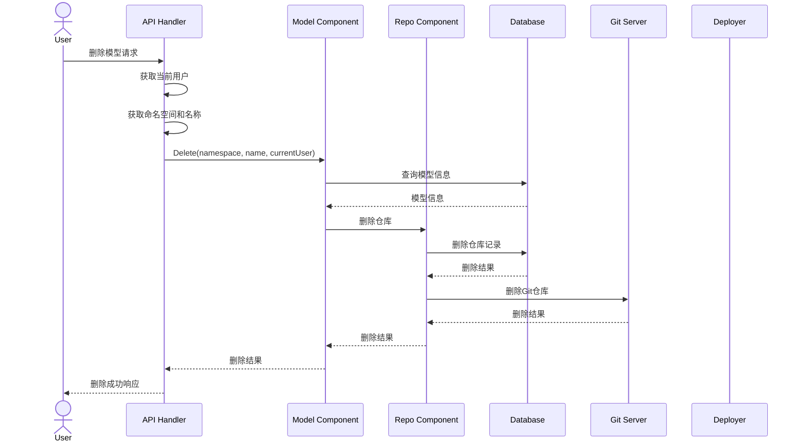

# 删除模型流程

```mermaid
sequenceDiagram
    actor User
    participant API as API Handler
    participant Component as Model Component
    participant Repo as Repo Component
    participant DB as Database
    participant Git as Git Server
    participant Deploy as Deployer

    %% 删除模型流程
    User->>API: 删除模型请求
    API->>API: 获取当前用户
    API->>API: 获取命名空间和名称
    API->>Component: Delete(namespace, name, currentUser)
    Component->>DB: 查询模型信息
    DB-->>Component: 模型信息
    Component->>Repo: 删除仓库
    Repo->>DB: 删除仓库记录
    DB-->>Repo: 删除结果
    Repo->>Git: 删除Git仓库
    Git-->>Repo: 删除结果
    Repo-->>Component: 删除结果
    Component-->>API: 删除结果
    API-->>User: 删除成功响应
```