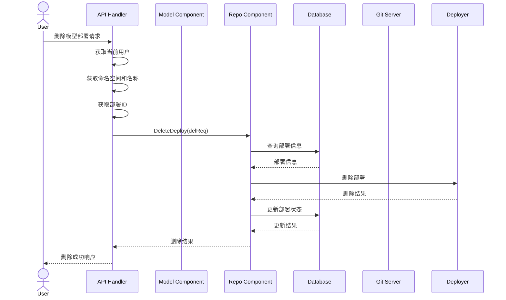

# 删除模型部署流程

```mermaid
sequenceDiagram
    actor User
    participant API as API Handler
    participant Component as Model Component
    participant Repo as Repo Component
    participant DB as Database
    participant Git as Git Server
    participant Deploy as Deployer

    %% 删除模型部署流程
    User->>API: 删除模型部署请求
    API->>API: 获取当前用户
    API->>API: 获取命名空间和名称
    API->>API: 获取部署ID
    API->>Repo: DeleteDeploy(delReq)
    Repo->>DB: 查询部署信息
    DB-->>Repo: 部署信息
    Repo->>Deploy: 删除部署
    Deploy-->>Repo: 删除结果
    Repo->>DB: 更新部署状态
    DB-->>Repo: 更新结果
    Repo-->>API: 删除结果
    API-->>User: 删除成功响应
```