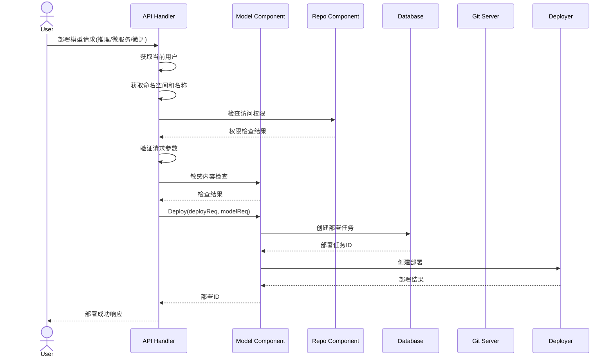

# 部署模型流程

```mermaid
sequenceDiagram
    actor User
    participant API as API Handler
    participant Component as Model Component
    participant Repo as Repo Component
    participant DB as Database
    participant Git as Git Server
    participant Deploy as Deployer

    %% 部署模型流程
    User->>API: 部署模型请求(推理/微服务/微调)
    API->>API: 获取当前用户
    API->>API: 获取命名空间和名称
    API->>Repo: 检查访问权限
    Repo-->>API: 权限检查结果
    API->>API: 验证请求参数
    API->>Component: 敏感内容检查
    Component-->>API: 检查结果
    API->>Component: Deploy(deployReq, modelReq)
    Component->>DB: 创建部署任务
    DB-->>Component: 部署任务ID
    Component->>Deploy: 创建部署
    Deploy-->>Component: 部署结果
    Component-->>API: 部署ID
    API-->>User: 部署成功响应
```