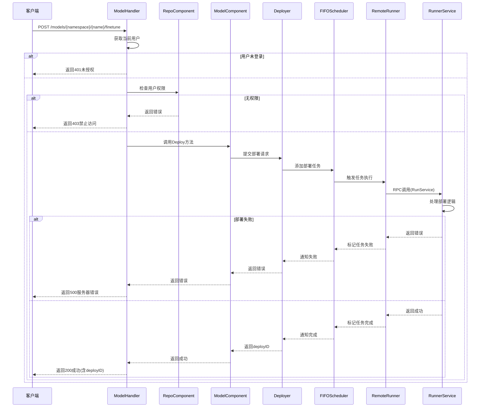

# 模型微调完整调用流程时序图

```mermaid
sequenceDiagram
    participant Client as 客户端
    participant ModelHandler as ModelHandler
    participant RepoComponent as RepoComponent
    participant ModelComponent as ModelComponent
    participant Deployer as Deployer
    participant FIFOScheduler as FIFOScheduler
    participant RemoteRunner as RemoteRunner
    participant RunnerService as RunnerService

    Client->>ModelHandler: POST /models/{namespace}/{name}/finetune
    ModelHandler->>ModelHandler: 获取当前用户
    alt 用户未登录
        ModelHandler-->>Client: 返回401未授权
    else
        ModelHandler->>RepoComponent: 检查用户权限
        alt 无权限
            RepoComponent-->>ModelHandler: 返回错误
            ModelHandler-->>Client: 返回403禁止访问
        else
            ModelHandler->>ModelComponent: 调用Deploy方法
            ModelComponent->>Deployer: 提交部署请求
            Deployer->>FIFOScheduler: 添加部署任务
            FIFOScheduler->>RemoteRunner: 触发任务执行
            RemoteRunner->>RunnerService: RPC调用(RunService)
            RunnerService->>RunnerService: 处理部署逻辑
            alt 部署失败
                RunnerService-->>RemoteRunner: 返回错误
                RemoteRunner-->>FIFOScheduler: 标记任务失败
                FIFOScheduler-->>Deployer: 通知失败
                Deployer-->>ModelComponent: 返回错误
                ModelComponent-->>ModelHandler: 返回错误
                ModelHandler-->>Client: 返回500服务器错误
            else
                RunnerService-->>RemoteRunner: 返回成功
                RemoteRunner-->>FIFOScheduler: 标记任务完成
                FIFOScheduler-->>Deployer: 通知完成
                Deployer-->>ModelComponent: 返回deployID
                ModelComponent-->>ModelHandler: 返回成功
                ModelHandler-->>Client: 返回200成功(含deployID)
            end
        end
    end
```