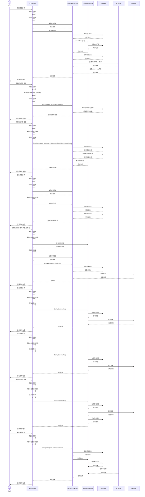

```mermaid
sequenceDiagram
    actor User
    participant API as API Handler
    participant Component as Model Component
    participant Repo as Repo Component
    participant DB as Database
    participant Git as Git Server
    participant Deploy as Deployer

    %% 创建模型流程
    User->>API: 创建模型请求
    API->>API: 获取当前用户
    API->>API: 验证请求参数
    API->>Component: 敏感内容检查
    Component-->>API: 检查结果
    API->>Component: Create(req)
    Component->>DB: 查询用户信息
    DB-->>Component: 用户信息
    Component->>Repo: CreateRepo(req)
    Repo->>DB: 创建仓库记录
    DB-->>Repo: 仓库记录
    Repo-->>Component: 仓库信息
    Component->>DB: 创建模型记录
    DB-->>Component: 模型记录
    Component->>Git: 创建README.md文件
    Git-->>Component: 创建结果
    Component->>Git: 创建.gitattributes文件
    Git-->>Component: 创建结果
    Component-->>API: 模型信息
    API-->>User: 创建成功响应

     %% 获取模型列表流程
    User->>API: 获取模型列表请求
    API->>API: 获取当前用户
    API->>API: 解析查询参数(标签、分页等)
    API->>API: 验证请求参数
    API->>Component: Index(filter, per, page, needOpWeight)
    Component->>DB: 查询符合条件的模型
    DB-->>Component: 模型列表和总数
    Component-->>API: 模型列表和总数
    API-->>User: 返回模型列表响应

    %% 获取单个模型详情流程
    User->>API: 获取模型详情请求
    API->>API: 获取当前用户
    API->>API: 获取命名空间和名称
    API->>API: 解析查询参数
    API->>Component: Show(namespace, name, currentUser, needOpWeight, needMultiSync)
    Component->>DB: 查询模型信息
    DB-->>Component: 模型基本信息
    Component->>DB: 查询模型关联信息
    DB-->>Component: 模型关联信息
    Component->>Repo: 获取仓库信息
    Repo-->>Component: 仓库信息
    Component-->>API: 完整模型详情
    API-->>User: 返回模型详情响应

    %% 编辑模型流程
    User->>API: 更新模型请求
    API->>API: 获取当前用户
    API->>API: 验证请求参数
    API->>Component: 敏感内容检查
    Component-->>API: 检查结果
    API->>API: 获取命名空间和名称
    API->>Component: Update(req)
    Component->>DB: 查询模型信息
    DB-->>Component: 模型信息
    Component->>DB: 更新模型记录
    DB-->>Component: 更新结果
    Component-->>API: 更新后的模型信息
    API-->>User: 更新成功响应

    %% 部署模型流程
    User->>API: 部署模型请求(推理/微服务/微调)
    API->>API: 获取当前用户
    API->>API: 获取命名空间和名称
    API->>Repo: 检查访问权限
    Repo-->>API: 权限检查结果
    API->>API: 验证请求参数
    API->>Component: 敏感内容检查
    Component-->>API: 检查结果
    API->>Component: Deploy(deployReq, modelReq)
    Component->>DB: 创建部署任务
    DB-->>Component: 部署任务ID
    Component->>Deploy: 创建部署
    Deploy-->>Component: 部署结果
    Component-->>API: 部署ID
    API-->>User: 部署成功响应

    %% 启动模型流程
    User->>API: 启动模型请求
    API->>API: 获取当前用户
    API->>API: 获取命名空间和名称
    API->>API: 获取部署ID
    API->>Repo: DeployStart(startReq)
    Repo->>DB: 查询部署信息
    DB-->>Repo: 部署信息
    Repo->>Deploy: 启动部署
    Deploy-->>Repo: 启动结果
    Repo-->>API: 启动结果
    API-->>User: 启动成功响应

    %% 停止模型流程
    User->>API: 停止模型请求
    API->>API: 获取当前用户
    API->>API: 获取命名空间和名称
    API->>API: 获取部署ID
    API->>Repo: DeployStop(stopReq)
    Repo->>DB: 查询部署信息
    DB-->>Repo: 部署信息
    Repo->>Deploy: 停止部署
    Deploy-->>Repo: 停止结果
    Repo-->>API: 停止结果
    API-->>User: 停止成功响应

    %% 删除模型部署流程
    User->>API: 删除模型部署请求
    API->>API: 获取当前用户
    API->>API: 获取命名空间和名称
    API->>API: 获取部署ID
    API->>Repo: DeleteDeploy(delReq)
    Repo->>DB: 查询部署信息
    DB-->>Repo: 部署信息
    Repo->>Deploy: 删除部署
    Deploy-->>Repo: 删除结果
    Repo->>DB: 更新部署状态
    DB-->>Repo: 更新结果
    Repo-->>API: 删除结果
    API-->>User: 删除成功响应

    %% 删除模型流程
    User->>API: 删除模型请求
    API->>API: 获取当前用户
    API->>API: 获取命名空间和名称
    API->>Component: Delete(namespace, name, currentUser)
    Component->>DB: 查询模型信息
    DB-->>Component: 模型信息
    Component->>Repo: 删除仓库
    Repo->>DB: 删除仓库记录
    DB-->>Repo: 删除结果
    Repo->>Git: 删除Git仓库
    Git-->>Repo: 删除结果
    Repo-->>Component: 删除结果
    Component-->>API: 删除结果
    API-->>User: 删除成功响应
```