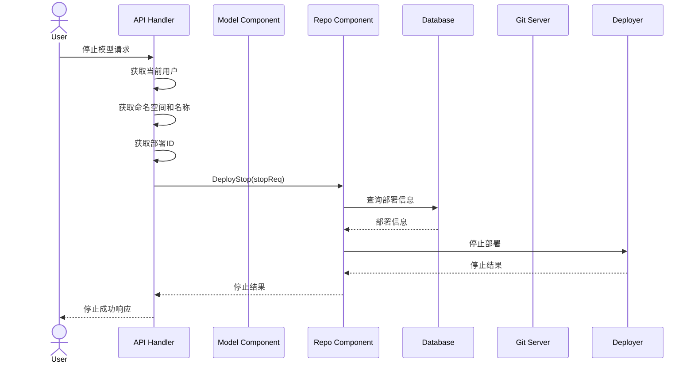

# 停止模型流程

```mermaid
sequenceDiagram
    actor User
    participant API as API Handler
    participant Component as Model Component
    participant Repo as Repo Component
    participant DB as Database
    participant Git as Git Server
    participant Deploy as Deployer

    %% 停止模型流程
    User->>API: 停止模型请求
    API->>API: 获取当前用户
    API->>API: 获取命名空间和名称
    API->>API: 获取部署ID
    API->>Repo: DeployStop(stopReq)
    Repo->>DB: 查询部署信息
    DB-->>Repo: 部署信息
    Repo->>Deploy: 停止部署
    Deploy-->>Repo: 停止结果
    Repo-->>API: 停止结果
    API-->>User: 停止成功响应
```