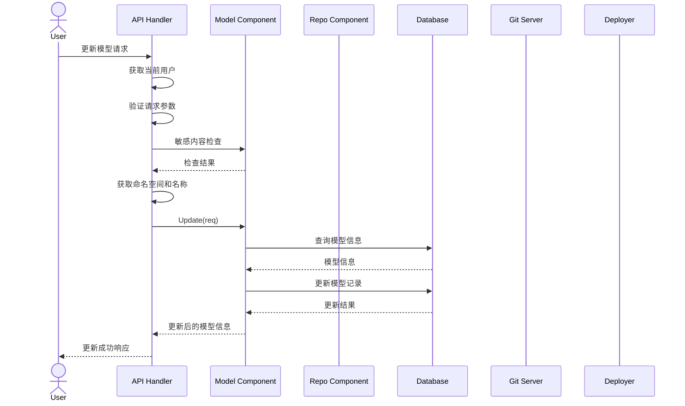

# 编辑模型流程

```mermaid
sequenceDiagram
    actor User
    participant API as API Handler
    participant Component as Model Component
    participant Repo as Repo Component
    participant DB as Database
    participant Git as Git Server
    participant Deploy as Deployer

    %% 编辑模型流程
    User->>API: 更新模型请求
    API->>API: 获取当前用户
    API->>API: 验证请求参数
    API->>Component: 敏感内容检查
    Component-->>API: 检查结果
    API->>API: 获取命名空间和名称
    API->>Component: Update(req)
    Component->>DB: 查询模型信息
    DB-->>Component: 模型信息
    Component->>DB: 更新模型记录
    DB-->>Component: 更新结果
    Component-->>API: 更新后的模型信息
    API-->>User: 更新成功响应
```