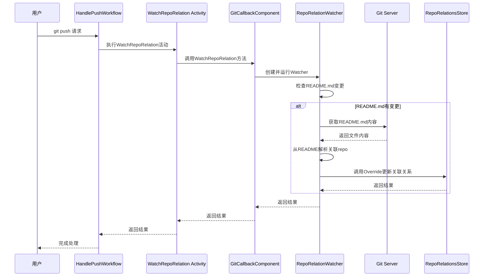

## 生成资产关联关系

```mermaid
sequenceDiagram
    participant User as 用户
    participant Workflow as HandlePushWorkflow
    participant Activity as WatchRepoRelation Activity
    participant Callback as GitCallbackComponent
    participant Watcher as RepoRelationWatcher
    participant GitServer as Git Server
    participant DB as RepoRelationsStore

    User->>Workflow: git push 请求
    Workflow->>Activity: 执行WatchRepoRelation活动
    Activity->>Callback: 调用WatchRepoRelation方法
    Callback->>Watcher: 创建并运行Watcher
    Watcher->>Watcher: 检查README.md变更
    alt README.md有变更
        Watcher->>GitServer: 获取README.md内容
        GitServer-->>Watcher: 返回文件内容
        Watcher->>Watcher: 从README解析关联repo
        Watcher->>DB: 调用Override更新关联关系
        DB-->>Watcher: 返回结果
    end
    Watcher-->>Callback: 返回结果
    Callback-->>Activity: 返回结果
    Activity-->>Workflow: 返回结果
    Workflow-->>User: 完成处理
```

